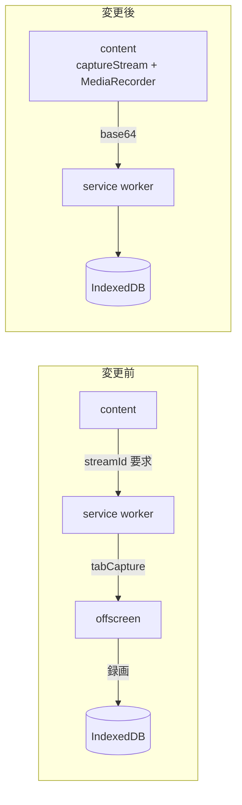
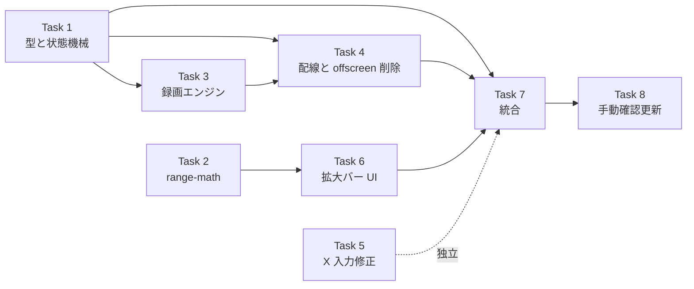

# 録画方式の変更と範囲指定 UI 実装プラン

> **実装者向け:** このプランは subagent-driven-development (推奨) または手動実行で消化する。step は `- [ ]` チェックボックスで track する。

**Goal:** タブ全体ではなく動画の中身だけを録画し、IN/OUT を拡大バー上のハンドルで微調整できるようにする。あわせて X への本文入力の失敗を解消する。

**Architecture:** `chrome.tabCapture` + offscreen document をやめ、content script から `video.captureStream()` を直接録画する。録画した Blob は base64 で service worker へ渡して保存する (content script は拡張の IndexedDB を読めないため)。範囲指定はプレイヤー下に出す拡大バーで行い、座標計算は純粋関数に切り出して単体テストで固める。

**Tech Stack:** TypeScript / Vite / @crxjs/vite-plugin / Vitest / Playwright (既存のまま。新規依存なし)

## Global Constraints

### Spec 由来 (spec から逐語コピー)

- 録画を開始する前に `video.mediaKeys` を確認する。`null` でなければ暗号化メディアが使われており、`captureStream()` は黒画面になる。この時点で失敗させる
- 新しい失敗理由: `drm-protected`、文言は「この動画は保護されているため録画できません」
- **開始前に判定することが要件である**（録画してから気付くと、ユーザーは実時間のコストを払った後で無駄と知ることになる）
- 本文入力は 3 段構え: (1) 本文入力を先・ファイル添付を後にする (2) `focus()` の後に `Range` / `Selection` を明示設定してから `execCommand` (3) それでも `false` なら `paste` イベントにフォールバック
- **どの方式で成功したかを `console.info` に残す**
- 拡大バーの窓: 幅は `max(範囲の長さ × 2, 30 秒)`、中心は範囲の中心。動画の端を超える場合はクランプする
- **窓はスクロールしない。** ハンドルが窓の端に達したらそこで止まる
- 最大 60 秒 / 最小 1 秒 (既存の `validateRange` をそのまま使う)
- 既定 15 秒の範囲。MVP では設定できるようにしない
- `ADJUST_RANGE` のペイロードは `{ range: ClipRange }` で、開始と終了の両方を毎回送る
- ドラッグ結果は**指を離したときに 1 度だけ**送る
- **録画中は範囲を変更できない。** `seeking` / `recording` / `encoding` の間は `MARK_IN` / `MARK_OUT` / `ADJUST_RANGE` のいずれも受け付けない
- `captureStream()` は `video` 要素の音声トラックも含めて返し、かつタブの音声出力を奪わないため、スピーカーへ流し戻す処理が要らなくなる
- **`marking` 状態を削除する**

### PJ 恒久ルール (CLAUDE.md / `.claude/rules/` 由来)

- コード内のコメント・ドキュメント・コミットメッセージはすべて **日本語**で記述する
- `cd <dir> && git ...` ではなく `git -C <dir> ...` を使う
- 日付・時刻を扱うときは JST と UTC を明示する。**動画内の再生位置 (秒) と実時刻を混同しない**。`createdAt` は UTC epoch ミリ秒
- **外部プロセスを起動して応答を待つ処理には必ず timeout を設定する**
- **Fail Fast**: 想定できる失敗は明示的な失敗状態としてユーザーに理由を提示し、握り潰した継続はしない
  - ※ 局所例外: 録画完了後の X 添付失敗のみ、例外を再 throw せず `downloadable` 状態へ退避させる
- ドキュメントとコード両方に修正がある場合、先にドキュメントを修正してからコードに着手する
- **main 直コミット禁止**

### 運用前提 (brainstorming で確定した実装方式)

- 隔離方式: **branch** (worktree なし)。ブランチ名 `feat/capture-and-range-ui` (作成済み)
- 並列方式: **SDD** (subagent-driven-development)
- spec は `.claude/specs/2026-09-11-capture-and-range-ui-design.md` に commit 済み (`97dafc7`)
- **既存実装は完成済み** (`feat/yt-clip-mvp` ブランチ、単体 118 件 + E2E 3 件 PASS)。このプランはその上に乗る改修であり、ゼロからの実装ではない
- 同一 working tree のため implementer は直列で派遣する

---

## 変更前後の構成



## ファイル構造マップ

| ファイル | 変更 | 責務 | 担当タスク |
|---|---|---|---|
| `src/shared/types.ts` | 改修 | `marking` 削除、`ADJUST_RANGE` 追加、失敗理由の入れ替え | Task 1 |
| `src/shared/messages.ts` | 改修 | `recorder/*` の送り先変更に伴う簡素化 | Task 1 |
| `src/background/state.ts` | 改修 | `marking` 削除に伴う遷移の整理 | Task 1 |
| `src/content/range-math.ts` | **新規** | ピクセル⇄秒の変換、窓の算出、制約クランプ。純粋関数 | Task 2 |
| `src/content/codec.ts` | **新規** (移設) | MP4 / WebM の判定。`src/offscreen/codec.ts` から移動 | Task 3 |
| `src/content/recorder.ts` | **新規** | `captureStream()` + `MediaRecorder` + DRM 検出 | Task 3 |
| `src/background/router.ts` | 改修 | 録画指示の送り先を offscreen から content へ | Task 4 |
| `src/background/sw.ts` | 改修 | `recorder/done` で base64 を受けて保存 | Task 4 |
| `src/content/x.ts` | 改修 | 入力順序の変更と 3 段構えの入力 | Task 5 |
| `src/content/range-bar.ts` | **新規** | 拡大バーの描画とドラッグ処理 | Task 6 |
| `src/content/youtube.ts` | 改修 | 注入と状態連携、録画の実行 | Task 7 |
| `src/popup/view.ts` | 改修 | `marking` 削除、`drm-protected` の文言 | Task 7 |
| `docs/manual-check.md` | 改修 | 確認項目の更新 | Task 8 |

**削除するファイル** (Task 4 で実施):
- `src/offscreen/codec.ts` / `recorder.ts` / `main.ts` / `offscreen.html`
- `src/background/capture.ts`
- `tests/offscreen/codec.test.ts`
- `tests/background/capture.test.ts`

## タスクの依存関係



Task 2 と Task 5 は他に依存しないので、どの順でも実施できる。

---

## Task 1: 型と状態機械の簡素化

**依存:** なし (最初に実施する)

**Files:**
- Modify: `src/shared/types.ts`, `src/shared/messages.ts`, `src/background/state.ts`
- Modify: `tests/background/state.test.ts`

**Interfaces:**
- Consumes: なし
- Produces: 後続の全タスクが依存する
  - `ClipState` から `marking` が消える
  - `ClipEvent`: `MARK_IN` は `{ range, meta }`、`ADJUST_RANGE` を追加
  - `FailureReason`: `capture-permission-denied` を削除、`drm-protected` を追加
  - `Message`: `recorder/start` は引数なし、`recorder/done` は `{ base64, mimeType }`

**設計メモ:** `MARK_IN` が `sec` ではなく `range` を受け取るようになる。既定 15 秒の範囲は content script 側 (Task 2 の `makeDefaultRange`) が作る。状態機械は「与えられた範囲を保持する」だけに徹し、範囲の作り方を知らない。

**録画中の拒否は状態機械にも置く。** `MARK_OUT` と `ADJUST_RANGE` は `switch` の網羅性で自動的に拒否されるが、`MARK_IN` はトップレベルで処理するためその保護から外れる。router と UI にも同じガードがあるが、そちらが漏れたときに防御が一枚も残らないのは避ける。判定に使う `BUSY_KINDS` は `types.ts` に置いて 3 箇所で共有する (これまで router と youtube.ts に重複定義されていた)。

`recorder/*` の送り先が offscreen から content script に変わるが、**メッセージ名は変えない**。名前を変えると router / content / テストの広い範囲に波及し、今回の変更の本質 (どこで録画するか) と関係ない差分が増えるため。

- [ ] **Step 1: 型を変更する**

`src/shared/types.ts` の `FailureReason` を置き換える:

```typescript
export type FailureReason =
  | "seek-failed"
  | "playback-failed"
  | "ad-playing"
  | "tab-lost"
  | "recording-aborted"
  /** 暗号化された動画は captureStream が黒画面を返すため録画できない */
  | "drm-protected"
  /** 状態機械の不正遷移など、ユーザー起因ではない内部エラー */
  | "internal-error";
```

`ClipState` から `marking` の行を削除する (他の要素はそのまま):

```typescript
export type ClipState =
  | { kind: "idle" }
  | { kind: "ready"; range: ClipRange; meta: VideoMeta }
  | { kind: "seeking"; range: ClipRange; meta: VideoMeta }
```

`ClipState` の定義の直後に、録画中を表す集合を置く。これまで `router.ts` と `youtube.ts` に同じ定義が重複していたが、状態の性質なので型と同じ場所に置く:

```typescript
/**
 * 録画が進行中で、範囲の変更を受け付けない状態。
 * 範囲を変えると状態機械だけが戻り、録画は走り続けて取り残される。
 */
export const BUSY_KINDS: ReadonlySet<ClipState["kind"]> = new Set([
  "seeking",
  "recording",
  "encoding",
]);
```

`ClipEvent` の `MARK_IN` を置き換え、`ADJUST_RANGE` を追加する:

```typescript
export type ClipEvent =
  /** 範囲の作成。既定の長さを決めるのは content script の責務 */
  | { type: "MARK_IN"; range: ClipRange; meta: VideoMeta }
  /** 終了位置だけを今の再生位置に合わせる */
  | { type: "MARK_OUT"; sec: number }
  /** 拡大バーでのドラッグ結果。取りこぼしで両者がずれないよう常に両端を送る */
  | { type: "ADJUST_RANGE"; range: ClipRange }
  | { type: "RESET_MARKS" }
  | { type: "START_RECORDING" }
  | { type: "SEEK_DONE" }
  | { type: "OUT_REACHED" }
  | { type: "BLOB_READY"; clipId: string; mimeType: string }
  | { type: "RETAKE" }
  | { type: "POST" }
  | { type: "ATTACHED" }
  | { type: "DEGRADE"; reason: DegradedReason }
  | { type: "FAIL"; reason: FailureReason }
  | { type: "RETRY" };
```

- [ ] **Step 2: メッセージを変更する**

`src/shared/messages.ts` の `recorder/*` を置き換える:

```typescript
  /**
   * sw → content: 録画開始。
   * 録画するのは content script なので、範囲も動画情報も content 側が持っている。
   * 使用する形式の判定も content 側で行う
   */
  | { type: "recorder/start" }
  /** sw → content: 録画停止 */
  | { type: "recorder/stop" }
  /** content → sw: 録画が実際に始まった。これを待ってから再生を再開させる */
  | { type: "recorder/started" }
  /**
   * content → sw: 録画結果。
   * content script は拡張の IndexedDB を読み書きできないため、
   * base64 にして渡し、保存は service worker が行う
   */
  | { type: "recorder/done"; base64: string; mimeType: string }
  /** content → sw: 録画中の失敗 */
  | { type: "recorder/failed"; reason: string }
```

`ClipRange` / `VideoMeta` の import が不要になったら削除する (`tsc --noEmit` が `noUnusedLocals` で教えてくれる)。

- [ ] **Step 3: テストを先に更新して失敗を確認する**

`tests/background/state.test.ts` を次の方針で更新する。

**削除するテスト** (`marking` が無くなるため):
- 「IN を打つと marking へ進む」
- 「OUT を打つと ready へ進む」
- 「ready からでも IN を打ち直せる」の `marking` を期待している部分

**置き換えるテスト** — `describe("マーク操作")` を丸ごと次に差し替える:

```typescript
describe("マーク操作", () => {
  test("初期状態は idle", () => {
    expect(INITIAL_STATE).toEqual({ kind: "idle" });
  });

  test("IN を打つと範囲つきで ready へ進む", () => {
    expect(
      reduce(INITIAL_STATE, { type: "MARK_IN", range, meta }),
    ).toEqual(ready);
  });

  test("ready からでも IN を打ち直せる", () => {
    const next: ClipRange = { startSec: 20, endSec: 50 };
    expect(reduce(ready, { type: "MARK_IN", range: next, meta })).toEqual({
      kind: "ready",
      range: next,
      meta,
    });
  });

  test("OUT は終了位置だけを更新する", () => {
    expect(reduce(ready, { type: "MARK_OUT", sec: 55 })).toEqual({
      kind: "ready",
      range: { startSec: 10, endSec: 55 },
      meta,
    });
  });

  test("ドラッグ結果は範囲をまるごと置き換える", () => {
    const dragged: ClipRange = { startSec: 12.5, endSec: 38.25 };
    expect(reduce(ready, { type: "ADJUST_RANGE", range: dragged })).toEqual({
      kind: "ready",
      range: dragged,
      meta,
    });
  });

  test("録画中は 3 つの操作すべてを拒否する", () => {
    // 状態機械だけが範囲を戻し、録画が走り続ける事態を防ぐ。
    // UI と router にも同じ制約があるが、そちらが漏れたときに
    // 防御が一枚も残らないのは避ける
    const other: ClipRange = { startSec: 0, endSec: 5 };

    for (const kind of ["seeking", "recording", "encoding"] as const) {
      const busy: ClipState = { kind, range, meta };

      expect(reduce(busy, { type: "MARK_IN", range: other, meta })).toMatchObject(
        { kind: "failed", reason: "internal-error" },
      );
      expect(reduce(busy, { type: "MARK_OUT", sec: 5 })).toMatchObject({
        kind: "failed",
        reason: "internal-error",
      });
      expect(
        reduce(busy, { type: "ADJUST_RANGE", range: other }),
      ).toMatchObject({ kind: "failed", reason: "internal-error" });
    }
  });

  test("RESET_MARKS で idle に戻る", () => {
    expect(reduce(ready, { type: "RESET_MARKS" })).toEqual({ kind: "idle" });
  });
});
```

**残りのテストで `{ type: "MARK_IN", sec: ..., meta }` を使っている箇所**を `{ type: "MARK_IN", range, meta }` に置き換える。`marking` を経由していた前提のヘルパがあれば、`MARK_IN` 1 回で `ready` になるよう直す。

実行: `npx vitest run tests/background/state.test.ts`
期待: FAIL (型エラー、または `marking` を期待する箇所での不一致)

- [ ] **Step 4: 状態機械を更新する**

`src/background/state.ts` の `reduce` を次のように変更する。

`MARK_IN` のトップレベル処理を置き換える:

```typescript
  if (event.type === "MARK_IN") {
    // 録画中に範囲を作り直させない。状態機械だけが戻って録画が走り続ける。
    // router と UI にも同じガードがあるが、そちらが漏れたときに
    // 防御が一枚も残らないのは避ける
    if (BUSY_KINDS.has(state.kind)) return invalid(state);
    return { kind: "ready", range: event.range, meta: event.meta };
  }
```

`import` に `BUSY_KINDS` を足す:

```typescript
import {
  BUSY_KINDS,
  type ClipEvent,
  type ClipRange,
  type ClipState,
  type VideoMeta,
} from "@/shared/types";
```

`case "marking":` のブロックを**丸ごと削除**する。

`case "idle":` はそのまま (`MARK_IN` はトップで処理済みなので、他は `invalid`)。

`case "ready":` を置き換える:

```typescript
    case "ready":
      if (event.type === "MARK_OUT") {
        return {
          kind: "ready",
          range: { startSec: state.range.startSec, endSec: event.sec },
          meta: state.meta,
        };
      }
      if (event.type === "ADJUST_RANGE") {
        return { kind: "ready", range: event.range, meta: state.meta };
      }
      if (event.type === "START_RECORDING") {
        return { kind: "seeking", range: state.range, meta: state.meta };
      }
      if (event.type === "RESET_MARKS") return { kind: "idle" };
      return invalid(state);
```

- [ ] **Step 5: 通過を確認する**

実行: `npx vitest run tests/background/state.test.ts && npx tsc --noEmit`
期待: state のテストは PASS。**`tsc` は他のファイルでエラーが出る** (`marking` を参照している `view.ts`、`MARK_IN` を送っている `youtube.ts` など)。これは後続タスクで解消するので、**この時点では state.test.ts の PASS だけを確認すればよい**。エラーが出ているファイル名を report に記録すること。

- [ ] **Step 6: commit**

```bash
git -C . add src/shared/types.ts src/shared/messages.ts src/background/state.ts tests/background/state.test.ts
git -C . commit -m "refactor: 範囲の作成を content script の責務に移す

IN を押した時点で既定の長さの範囲ができる UI に変えるため、
marking (IN だけ打った中間状態) が不要になる。状態機械は与えられた
範囲を保持するだけにし、既定の長さの決め方は知らない形にする。

あわせて録画を content script で行う変更に備え、recorder の
メッセージから範囲と動画情報を落とす。どちらも content 側が持っている。"
```

---

## Task 2: 範囲の計算 (range-math.ts)

**依存:** なし (Task 1 と並行して着手できるが、同一 working tree なので順に実施する)

**Files:**
- Create: `src/content/range-math.ts`
- Test: `tests/content/range-math.test.ts`

**Interfaces:**
- Consumes: `ClipRange` (`@/shared/types`)、`MAX_CLIP_SEC` / `MIN_CLIP_SEC` (`@/shared/time`)
- Produces:
  - `DEFAULT_CLIP_SEC` / `MIN_WINDOW_SEC` 定数
  - `TimeWindow` 型: `{ startSec: number; endSec: number }`
  - `HandleKind` 型: `"in" | "out"`
  - `makeDefaultRange(startSec: number, videoDurationSec: number): ClipRange`
  - `computeWindow(range: ClipRange, videoDurationSec: number): TimeWindow`
  - `timeToRatio(sec: number, window: TimeWindow): number`
  - `ratioToTime(ratio: number, window: TimeWindow): number`
  - `clampHandle(kind: HandleKind, desiredSec: number, range: ClipRange, window: TimeWindow): ClipRange`

**設計メモ:** この task が作るのは**すべて純粋関数**で、DOM にも chrome API にも触れない。拡大バーの不具合は「計算が違う」か「描画と配線が違う」のどちらかだが、計算をここで固めておけば後者に絞り込める。座標計算は実機でしか気付けない類の間違いが起きやすいので、テストを厚くする。

**入力は全公開関数で検証する。** 一部だけ検証すると、検証していない経路から `NaN` が入って黙って下流へ流れる。`Math.max(0, NaN)` は `NaN` を返すので、丸めでは防げない。順序の逆転 (`endSec < startSec`) も、そのままだと「もっともらしいが無意味な」結果を返すため弾く。

`clampHandle` は「動かしたい位置」を受け取り、制約を適用した**範囲全体**を返す。片方のハンドルだけを返さないのは、最大長の制約で反対側も動く可能性があるため……ではなく、**反対側は動かさない**方針を型で表すためである。呼び出し側が「どちらを動かしたか」を忘れても、返ってきた範囲をそのまま使えばよい。

- [ ] **Step 1: 失敗するテストを書く**

`tests/content/range-math.test.ts`:

```typescript
import { describe, expect, test } from "vitest";
import {
  DEFAULT_CLIP_SEC,
  MIN_WINDOW_SEC,
  clampHandle,
  computeWindow,
  makeDefaultRange,
  ratioToTime,
  timeToRatio,
} from "@/content/range-math";
import { MAX_CLIP_SEC, MIN_CLIP_SEC } from "@/shared/time";

describe("makeDefaultRange", () => {
  test("押した位置から既定の長さの範囲を作る", () => {
    expect(makeDefaultRange(100, 600)).toEqual({
      startSec: 100,
      endSec: 100 + DEFAULT_CLIP_SEC,
    });
  });

  test("動画の末尾を越えない", () => {
    // 残り 5 秒しかない位置で押した場合
    expect(makeDefaultRange(595, 600)).toEqual({ startSec: 595, endSec: 600 });
  });

  test("末尾ぎりぎりで押しても最小の長さは確保する", () => {
    // 残りが最小長に満たないので、開始位置を手前にずらす
    expect(makeDefaultRange(599.5, 600)).toEqual({
      startSec: 600 - MIN_CLIP_SEC,
      endSec: 600,
    });
  });

  test("動画自体が既定より短い場合は動画全体になる", () => {
    expect(makeDefaultRange(0, 8)).toEqual({ startSec: 0, endSec: 8 });
  });

  test("不正な値は握り潰さず throw する", () => {
    expect(() => makeDefaultRange(-1, 600)).toThrow(RangeError);
    expect(() => makeDefaultRange(100, Number.NaN)).toThrow(RangeError);
  });
});

describe("computeWindow", () => {
  test("範囲の前後に余裕を持たせる", () => {
    // 30 秒の範囲 → 窓は 60 秒、中心は範囲の中心 (115)
    expect(computeWindow({ startSec: 100, endSec: 130 }, 600)).toEqual({
      startSec: 85,
      endSec: 145,
    });
  });

  test("短い範囲でも窓は最小幅を保つ", () => {
    // 2 秒の範囲。2 倍では狭すぎるので最小幅が効く
    const window = computeWindow({ startSec: 100, endSec: 102 }, 600);
    expect(window.endSec - window.startSec).toBe(MIN_WINDOW_SEC);
    expect((window.startSec + window.endSec) / 2).toBeCloseTo(101);
  });

  test("動画の先頭を越えない", () => {
    const window = computeWindow({ startSec: 2, endSec: 8 }, 600);
    expect(window.startSec).toBe(0);
    // 先頭で切り詰めた分は後ろへ回し、幅は保つ
    expect(window.endSec - window.startSec).toBe(MIN_WINDOW_SEC);
  });

  test("動画の末尾を越えない", () => {
    const window = computeWindow({ startSec: 592, endSec: 598 }, 600);
    expect(window.endSec).toBe(600);
    expect(window.endSec - window.startSec).toBe(MIN_WINDOW_SEC);
  });

  test("動画が窓より短い場合は動画全体が窓になる", () => {
    expect(computeWindow({ startSec: 2, endSec: 8 }, 20)).toEqual({
      startSec: 0,
      endSec: 20,
    });
  });

  test("順序が逆転した範囲は受け付けない", () => {
    expect(() => computeWindow({ startSec: 150, endSec: 100 }, 600)).toThrow(
      RangeError,
    );
  });
});

describe("timeToRatio / ratioToTime", () => {
  const window = { startSec: 100, endSec: 160 };

  test("窓の両端が 0 と 1 になる", () => {
    expect(timeToRatio(100, window)).toBe(0);
    expect(timeToRatio(160, window)).toBe(1);
  });

  test("中間は線形に対応する", () => {
    expect(timeToRatio(130, window)).toBeCloseTo(0.5);
    expect(ratioToTime(0.5, window)).toBeCloseTo(130);
  });

  test("往復しても値が保たれる", () => {
    for (const sec of [100, 117.5, 130, 159.9, 160]) {
      expect(ratioToTime(timeToRatio(sec, window), window)).toBeCloseTo(sec);
    }
  });

  test("窓の外は 0 と 1 に丸める", () => {
    expect(timeToRatio(50, window)).toBe(0);
    expect(timeToRatio(200, window)).toBe(1);
    expect(ratioToTime(-0.5, window)).toBe(100);
    expect(ratioToTime(1.5, window)).toBe(160);
  });

  test("不正な値は握り潰さず throw する", () => {
    // Math.max(0, NaN) は NaN を返すので、丸めでは防げない。
    // 黙って NaN が下流へ流れると、範囲が壊れたまま保存されうる
    expect(() => timeToRatio(Number.NaN, window)).toThrow(RangeError);
    expect(() => ratioToTime(Number.NaN, window)).toThrow(RangeError);
    expect(() =>
      timeToRatio(100, { startSec: Number.NaN, endSec: 160 }),
    ).toThrow(RangeError);
  });
});

describe("clampHandle", () => {
  const window = { startSec: 100, endSec: 160 };
  const range = { startSec: 120, endSec: 140 };

  test("IN を動かすと開始位置だけが変わる", () => {
    expect(clampHandle("in", 125, range, window)).toEqual({
      startSec: 125,
      endSec: 140,
    });
  });

  test("OUT を動かすと終了位置だけが変わる", () => {
    expect(clampHandle("out", 135, range, window)).toEqual({
      startSec: 120,
      endSec: 135,
    });
  });

  test("IN は窓の左端で止まる", () => {
    expect(clampHandle("in", 50, range, window)).toEqual({
      startSec: 100,
      endSec: 140,
    });
  });

  test("OUT は窓の右端で止まる", () => {
    expect(clampHandle("out", 500, range, window)).toEqual({
      startSec: 120,
      endSec: 160,
    });
  });

  test("IN は最小の長さを侵さない", () => {
    // OUT (140) に近づけすぎない
    expect(clampHandle("in", 139.9, range, window)).toEqual({
      startSec: 140 - MIN_CLIP_SEC,
      endSec: 140,
    });
  });

  test("OUT は最小の長さを侵さない", () => {
    expect(clampHandle("out", 120.1, range, window)).toEqual({
      startSec: 120,
      endSec: 120 + MIN_CLIP_SEC,
    });
  });

  test("最大の長さを超えない", () => {
    // 窓が十分に広い場合でも 60 秒で止まる
    const wide = { startSec: 0, endSec: 300 };
    const from = { startSec: 100, endSec: 120 };
    expect(clampHandle("out", 280, from, wide)).toEqual({
      startSec: 100,
      endSec: 100 + MAX_CLIP_SEC,
    });
    expect(clampHandle("in", 10, from, wide)).toEqual({
      startSec: 120 - MAX_CLIP_SEC,
      endSec: 120,
    });
  });

  test("不正な値は握り潰さず throw する", () => {
    expect(() => clampHandle("in", Number.NaN, range, window)).toThrow(
      RangeError,
    );
    // 範囲や窓が壊れていても、結果が NaN のまま返ることがないようにする
    expect(() =>
      clampHandle("in", 125, { startSec: 120, endSec: Number.NaN }, window),
    ).toThrow(RangeError);
    expect(() =>
      clampHandle("in", 125, range, { startSec: Number.NaN, endSec: 160 }),
    ).toThrow(RangeError);
  });

  test("順序が逆転した範囲は受け付けない", () => {
    // 呼び出し側のバグを黙って通すと、もっともらしいが無意味な結果を返す
    expect(() =>
      clampHandle("in", 125, { startSec: 150, endSec: 100 }, window),
    ).toThrow(RangeError);
  });
});
```

- [ ] **Step 2: 実行して失敗を確認**

実行: `npx vitest run tests/content/range-math.test.ts`
期待: FAIL (`Failed to resolve import "@/content/range-math"`)

- [ ] **Step 3: range-math.ts を実装する**

`src/content/range-math.ts`:

```typescript
import { MAX_CLIP_SEC, MIN_CLIP_SEC } from "@/shared/time";
import type { ClipRange } from "@/shared/types";

/** IN を押したときに作られる範囲の長さ (秒) */
export const DEFAULT_CLIP_SEC = 15;

/** 拡大バーが表示する最小の時間幅 (秒)。短い範囲でも調整の余地を残す */
export const MIN_WINDOW_SEC = 30;

/** 拡大バーが映している時間帯 */
export type TimeWindow = {
  startSec: number;
  endSec: number;
};

export type HandleKind = "in" | "out";

function assertSeconds(value: number, label: string): void {
  if (!Number.isFinite(value) || value < 0) {
    throw new RangeError(`${label} が再生位置として不正です: ${value}`);
  }
}

/** 範囲として筋が通っているか。値そのものだけでなく順序も見る */
function assertRange(range: ClipRange): void {
  assertSeconds(range.startSec, "開始位置");
  assertSeconds(range.endSec, "終了位置");
  if (range.endSec < range.startSec) {
    throw new RangeError(
      `終了位置が開始位置より前です: ${range.startSec} → ${range.endSec}`,
    );
  }
}

function assertWindow(window: TimeWindow): void {
  assertSeconds(window.startSec, "窓の開始");
  assertSeconds(window.endSec, "窓の終了");
}

/** 指定した幅の区間を、0 から duration の中に収める */
function fitWithin(
  centerSec: number,
  widthSec: number,
  durationSec: number,
): TimeWindow {
  // 動画自体が幅より短いなら、動画全体を見せるほかない
  if (durationSec <= widthSec) {
    return { startSec: 0, endSec: durationSec };
  }

  let startSec = centerSec - widthSec / 2;
  // 端から溢れた分は反対側へ回す。幅を縮めると調整の余地が減るため
  if (startSec < 0) startSec = 0;
  if (startSec + widthSec > durationSec) startSec = durationSec - widthSec;

  return { startSec, endSec: startSec + widthSec };
}

/**
 * IN を押した位置から既定の長さの範囲を作る。
 * 動画の末尾に近い場合は、最小の長さを確保できるところまで開始位置を手前へずらす。
 */
export function makeDefaultRange(
  startSec: number,
  videoDurationSec: number,
): ClipRange {
  assertSeconds(startSec, "開始位置");
  assertSeconds(videoDurationSec, "動画の長さ");

  const endSec = Math.min(startSec + DEFAULT_CLIP_SEC, videoDurationSec);
  if (endSec - startSec >= MIN_CLIP_SEC) {
    return { startSec, endSec };
  }

  // 末尾ぎりぎりで押された。最小の長さを確保できる位置まで戻す
  return {
    startSec: Math.max(0, videoDurationSec - MIN_CLIP_SEC),
    endSec: videoDurationSec,
  };
}

/**
 * 拡大バーが映す時間帯を決める。
 * 範囲の前後に余裕を持たせて、ハンドルを動かせる余地を残す。
 */
export function computeWindow(
  range: ClipRange,
  videoDurationSec: number,
): TimeWindow {
  assertRange(range);
  assertSeconds(videoDurationSec, "動画の長さ");

  const rangeSec = range.endSec - range.startSec;
  const widthSec = Math.max(rangeSec * 2, MIN_WINDOW_SEC);
  const centerSec = (range.startSec + range.endSec) / 2;

  return fitWithin(centerSec, widthSec, videoDurationSec);
}

/**
 * 再生位置を窓の中の割合 (0..1) に変換する。
 * 窓の外は 0 と 1 に丸める。範囲外は「端まで動かした」という意味を持つため。
 */
export function timeToRatio(sec: number, window: TimeWindow): number {
  assertSeconds(sec, "再生位置");
  assertWindow(window);

  const widthSec = window.endSec - window.startSec;
  if (widthSec <= 0) return 0;

  const ratio = (sec - window.startSec) / widthSec;
  return Math.min(1, Math.max(0, ratio));
}

/** 窓の中の割合 (0..1) を再生位置に変換する */
export function ratioToTime(ratio: number, window: TimeWindow): number {
  // 割合は負にもなりうる (端の外へドラッグした場合) ので、有限かどうかだけ見る。
  // NaN を通すと Math.max も素通りしてしまい、黙って NaN が下流へ流れる
  if (!Number.isFinite(ratio)) {
    throw new RangeError(`割合が不正です: ${ratio}`);
  }
  assertWindow(window);

  const clamped = Math.min(1, Math.max(0, ratio));
  return window.startSec + (window.endSec - window.startSec) * clamped;
}

/**
 * ハンドルを動かした結果の範囲を返す。
 * 窓の外へは出さず、最小・最大の長さも侵さない。反対側のハンドルは動かさない。
 */
export function clampHandle(
  kind: HandleKind,
  desiredSec: number,
  range: ClipRange,
  window: TimeWindow,
): ClipRange {
  assertSeconds(desiredSec, "ハンドルの位置");
  assertRange(range);
  assertWindow(window);

  if (kind === "in") {
    const lowest = Math.max(window.startSec, range.endSec - MAX_CLIP_SEC);
    const highest = range.endSec - MIN_CLIP_SEC;
    return {
      startSec: Math.min(highest, Math.max(lowest, desiredSec)),
      endSec: range.endSec,
    };
  }

  const lowest = range.startSec + MIN_CLIP_SEC;
  const highest = Math.min(window.endSec, range.startSec + MAX_CLIP_SEC);
  return {
    startSec: range.startSec,
    endSec: Math.max(lowest, Math.min(highest, desiredSec)),
  };
}
```

- [ ] **Step 4: 実行して通過を確認**

実行: `npx vitest run tests/content/range-math.test.ts`
期待: PASS (25 tests)

- [ ] **Step 5: commit**

```bash
git -C . add src/content/range-math.ts tests/content/range-math.test.ts
git -C . commit -m "feat: 拡大バーの範囲計算を追加

座標計算は実機でしか気付けない間違いが起きやすいので、DOM に
触れない純粋関数として切り出してテストで固める。これで拡大バーの
不具合を「計算」か「描画と配線」かに切り分けられる。

窓が動画の端で溢れる場合は幅を縮めず反対側へ回す。幅を縮めると
調整の余地がそのぶん減るため。"
```

---

## Task 3: content script 側の録画エンジン

**依存:** Task 1

**Files:**
- Create: `src/content/codec.ts` (`src/offscreen/codec.ts` から移設)
- Create: `src/content/recorder.ts`
- Test: `tests/content/codec.test.ts` (`tests/offscreen/codec.test.ts` から移設)
- Test: `tests/content/recorder.test.ts` (新規。DRM 検出のみ)

**Interfaces:**
- Consumes: なし
- Produces:
  - `MP4_MIME` / `WEBM_MIME` / `pickMimeType(isTypeSupported?)` (`@/content/codec`) — 移設のみで中身は変えない
  - `DrmProtectedError` クラス
  - `assertRecordable(video: HTMLVideoElement): void`
  - `RecorderHandle` = `{ stop(): Promise<Blob> }`
  - `RecorderOptions` = `{ onUnexpectedStop(error: Error): void }`
  - `startRecording(video: HTMLVideoElement, mimeType: string, options: RecorderOptions): Promise<RecorderHandle>`

**設計メモ:** `src/offscreen/recorder.ts` の構造 (解放の一元化、`onstop` を `start()` 直後に装着、予期しない停止の通知) は**そのまま引き継ぐ**。あれは実機で起きるリソースリークと無音ハングを潰した結果であり、方式が変わっても同じ問題は起きる。

変わるのは 2 点だけ:
- ストリームの取得元が `getUserMedia(tabConstraints)` から `video.captureStream()` へ
- **音声パススルーが不要になる。** `captureStream()` はタブの音声出力を奪わないため、`AudioContext` ごと削除する

`assertRecordable` を `startRecording` の中ではなく独立した関数にするのは、**録画を始める前**に呼びたいからである。要件は「開始前に判定する」ことで、`startRecording` に入ってから投げたのでは呼び出し側の扱いが「録画の失敗」になってしまう。

- [ ] **Step 1: codec を移設する**

`src/offscreen/codec.ts` を `src/content/codec.ts` へ、`tests/offscreen/codec.test.ts` を `tests/content/codec.test.ts` へ移動する。

```bash
git -C . mv src/offscreen/codec.ts src/content/codec.ts
git -C . mv tests/offscreen/codec.test.ts tests/content/codec.test.ts
```

テスト側の import を `@/offscreen/codec` から `@/content/codec` に書き換える。**中身は変えない。**

実行: `npx vitest run tests/content/codec.test.ts`
期待: PASS (4 tests)

- [ ] **Step 2: DRM 検出の失敗するテストを書く**

`tests/content/recorder.test.ts`:

```typescript
// @vitest-environment jsdom
import { describe, expect, test } from "vitest";
import { DrmProtectedError, assertRecordable } from "@/content/recorder";

/** mediaKeys は読み取り専用なので、テストからは定義し直して差し替える */
function makeVideo(mediaKeys: unknown): HTMLVideoElement {
  const video = document.createElement("video");
  Object.defineProperty(video, "mediaKeys", {
    value: mediaKeys,
    configurable: true,
  });
  return video;
}

describe("assertRecordable", () => {
  test("保護されていない動画は通す", () => {
    expect(() => assertRecordable(makeVideo(null))).not.toThrow();
  });

  test("暗号化されている動画は録画前に弾く", () => {
    // captureStream は黒画面を返すだけで失敗しないため、
    // ここで止めないと実時間を払った後で無駄と分かることになる
    expect(() => assertRecordable(makeVideo({}))).toThrow(DrmProtectedError);
  });

  test("失敗の理由が分かるメッセージを持つ", () => {
    expect(() => assertRecordable(makeVideo({}))).toThrow(
      "この動画は保護されているため録画できません",
    );
  });
});
```

- [ ] **Step 3: 実行して失敗を確認**

実行: `npx vitest run tests/content/recorder.test.ts`
期待: FAIL (`Failed to resolve import "@/content/recorder"`)

- [ ] **Step 4: recorder.ts を実装する**

`src/content/recorder.ts`:

```typescript
export class DrmProtectedError extends Error {
  constructor() {
    super("この動画は保護されているため録画できません");
    this.name = "DrmProtectedError";
  }
}

export type RecorderHandle = {
  /** 録画を止めて Blob を確定させる */
  stop(): Promise<Blob>;
};

export type RecorderOptions = {
  /**
   * 明示的な `stop()` より前に録画が終わってしまったときに呼ばれる。
   * 録画中の異常を呼び出し側が即座に知るための唯一の経路であり、
   * これが無いと OUT 到達まで (最大 60 秒) 異常に気付けない。
   */
  onUnexpectedStop(error: Error): void;
};

/** captureStream は標準の型定義に含まれないため補う */
type CapturableVideo = HTMLVideoElement & {
  captureStream?: () => MediaStream;
};

/**
 * この動画を録画してよいか確かめる。
 *
 * **録画を始める前に呼ぶこと。** 暗号化された動画の `captureStream()` は
 * 失敗せず黒画面を返すため、始めてしまうと実時間を払い切った後で
 * 無駄だったと分かることになる。
 */
export function assertRecordable(video: HTMLVideoElement): void {
  if (video.mediaKeys !== null) {
    throw new DrmProtectedError();
  }
}

/**
 * 再生中の動画そのものを録画する。
 *
 * タブではなく `video` 要素から直接ストリームを取るので、コメント欄や
 * プレイヤーの操作系は映らず、解像度も再生中の表示サイズに縛られない。
 *
 * リソース解放の設計:
 * `stop` イベントは明示的な `stop()` 呼び出しだけでなく、録画が致命的エラーで
 * 死んだときにブラウザ側からも発火する。そのため `onstop` は `start()` の直後に
 * 一度だけ装着し、どちらの経路でも必ず解放が走るようにする。
 */
export async function startRecording(
  video: HTMLVideoElement,
  mimeType: string,
  options: RecorderOptions,
): Promise<RecorderHandle> {
  const target = video as CapturableVideo;
  if (typeof target.captureStream !== "function") {
    throw new Error("この環境では動画を直接録画できません");
  }

  const stream = target.captureStream();

  /** 取得済みのリソースを解放する。二度呼ばれても安全 */
  function release(): void {
    for (const track of stream.getTracks()) {
      track.stop();
    }
  }

  try {
    const recorder = new MediaRecorder(stream, { mimeType });
    const chunks: Blob[] = [];
    let recordingError: Error | null = null;
    /** 録画が終わった (自動・明示どちらでも) ときに解決する */
    let settleStopped: (() => void) | null = null;
    let stopped = false;

    recorder.ondataavailable = (event) => {
      if (event.data.size > 0) {
        chunks.push(event.data);
      }
    };
    recorder.onerror = (event) => {
      recordingError = new Error(`録画中にエラーが発生しました: ${event.type}`);
    };
    recorder.onstop = () => {
      stopped = true;
      release();

      if (settleStopped !== null) {
        settleStopped();
        return;
      }
      // stop() を待たずに終了した = 録画中の異常。呼び出し側へ即座に知らせる
      options.onUnexpectedStop(
        recordingError ?? new Error("録画が予期せず終了しました"),
      );
    };

    // 1 秒ごとに chunk を吐かせ、長い録画でもメモリが一度に膨らまないようにする
    recorder.start(1000);

    return {
      stop() {
        return new Promise<Blob>((resolve, reject) => {
          const finish = (): void => {
            if (recordingError !== null) {
              reject(recordingError);
              return;
            }
            resolve(new Blob(chunks, { type: mimeType }));
          };

          // 既にエラーで停止済みなら、改めて stop() を呼ばずに結果を返す
          if (stopped) {
            finish();
            return;
          }

          settleStopped = finish;
          recorder.stop();
        });
      },
    };
  } catch (error) {
    // 録画を開始できなかった場合、取得済みのストリームを掴んだままにしない
    release();
    throw error;
  }
}
```

- [ ] **Step 5: 実行して通過を確認**

実行: `npx vitest run tests/content/recorder.test.ts tests/content/codec.test.ts`
期待: PASS (7 tests)

- [ ] **Step 6: commit**

```bash
git -C . add src/content/codec.ts src/content/recorder.ts tests/content/codec.test.ts tests/content/recorder.test.ts
git -C . commit -m "feat: 動画そのものを録画するエンジンを content script に追加

タブ全体ではなく video 要素から直接ストリームを取る。コメント欄や
プレイヤーの操作系が映らなくなり、解像度も表示サイズに縛られない。
タブの音声出力を奪わないため、スピーカーへ流し戻す処理も不要になる。

暗号化された動画は captureStream が失敗せず黒画面を返すので、
録画を始める前に弾く。始めてしまうと実時間を払い切った後で無駄だと
分かることになる。"
```

---

## Task 4: 配線の切り替えと offscreen の削除

**依存:** Task 1, Task 3

**Files:**
- Modify: `src/background/router.ts`, `src/background/sw.ts`
- Modify: `manifest.config.ts`, `vite.config.ts`
- Modify: `tests/background/router.test.ts`
- Delete: `src/offscreen/recorder.ts`, `src/offscreen/main.ts`, `src/offscreen/offscreen.html`, `src/background/capture.ts`, `tests/background/capture.test.ts`

**Interfaces:**
- Consumes: `decodeBase64` (`@/shared/base64`)、`StoredClip` / `saveClip` (`@/background/storage`)
- Produces: `RouterDeps` から `ensureOffscreen` / `getStreamId` が消え、`saveClip` が戻る

**設計メモ:** 録画の実行場所が変わるだけで、**状態機械の流れは変えない**。`seeking → recording` の間に動画を進めないという順序制御は、クリップ冒頭の欠けを防ぐために引き続き必要である。

`saveClip` を `RouterDeps` に戻す。前回「offscreen が直接保存するので router からは呼ばれない」という理由で削除したが、content script は拡張の IndexedDB を読み書きできないため、保存は再び service worker の仕事になる。

`prepareCapture` は不要になる。`streamId` の取得も offscreen の起動も無くなり、`START_RECORDING` を受けたときに service worker がすることは何もない (content script が自分で seek を始める)。

- [ ] **Step 1: テストを先に更新して失敗を確認する**

`tests/background/router.test.ts` を次の方針で更新する。

**`makeHarness` の `deps` から削除**: `ensureOffscreen`、`getStreamId`
**`makeHarness` の `deps` に復活**: `saveClip: async (clip) => { saved.push(clip); }` と `Harness.saved`

**`recorder/done` を送っている箇所**をすべて次の形に置き換える:

```typescript
    await h.router.handle({
      type: "recorder/done",
      base64: "AAECAw==",
      mimeType: "video/mp4",
    });
```

**削除するテスト** (`ensureOffscreen` / `getStreamId` が無くなるため):
- 「録画要求で offscreen を用意し streamId を取る」
- 「streamId が取れなければ理由つきで失敗する」
- 「二度目の録画要求では録画準備をやり直さない」の `ensureOffscreen` / `getStreamId` の呼び出し回数を見ている部分 (状態が `seeking` のままであることの確認は残す)
- 「保存先を先に決めて offscreen へ渡す」

**追加するテスト** — `describe("録画の開始")` に次を足す:

```typescript
  test("seek 完了を受けたら録画対象のタブへ開始を指示する", async () => {
    const h = makeHarness();
    await markRange(h.router);
    await h.router.handle({
      type: "clip/event",
      event: { type: "START_RECORDING" },
    });
    await h.router.handle({ type: "clip/event", event: { type: "SEEK_DONE" } });

    // 録画するのは content script なので、指示はタブ宛に送る
    expect(h.sentToTab).toContainEqual({
      tabId: 7,
      message: { type: "recorder/start" },
    });
  });

  test("録画対象のタブが分からなければ失敗として提示する", async () => {
    const h = makeHarness();
    // タブ ID を持たない経路 (popup から直接) で範囲を作る
    await h.router.handle({
      type: "clip/event",
      event: { type: "MARK_IN", range, meta },
    });
    await h.router.handle({
      type: "clip/event",
      event: { type: "START_RECORDING" },
    });
    await h.router.handle({ type: "clip/event", event: { type: "SEEK_DONE" } });

    expect(h.router.getState()).toMatchObject({
      kind: "failed",
      reason: "tab-lost",
    });
  });
```

**`describe("録画の終了と保存")` に次を足す:**

```typescript
  test("受け取った base64 を復元して保存する", async () => {
    const h = makeHarness();
    await recordUntilEncoding(h);
    // "AAECAw==" は 0x00 0x01 0x02 0x03 の 4 バイト
    await h.router.handle({
      type: "recorder/done",
      base64: "AAECAw==",
      mimeType: "video/mp4",
    });

    expect(h.saved).toHaveLength(1);
    expect(h.saved[0]).toMatchObject({ mimeType: "video/mp4", range, meta });
    expect(await h.saved[0]!.blob.arrayBuffer()).toEqual(
      new Uint8Array([0, 1, 2, 3]).buffer,
    );
  });
```

実行: `npx vitest run tests/background/router.test.ts`
期待: FAIL (型エラー、および `recorder/start` が `sendToRuntime` に送られていることによる不一致)

- [ ] **Step 2: router を更新する**

`src/background/router.ts` の変更点。

**import から `ensureOffscreen` / `getStreamId` / `CapturePermissionError` を削除**し、`decodeBase64` を追加する:

```typescript
import { INITIAL_STATE, reduce } from "@/background/state";
import type { StoredClip } from "@/background/storage";
import { decodeBase64, encodeBase64 } from "@/shared/base64";
import { buildClipFileName } from "@/shared/filename";
import type { Message } from "@/shared/messages";
import { renderTemplate } from "@/shared/template";
import type { ClipEvent, ClipState, FailureReason } from "@/shared/types";
```

**`RouterDeps` を更新** (`ensureOffscreen` / `getStreamId` を削除し `saveClip` を復活):

```typescript
export type RouterDeps = {
  saveClip(clip: StoredClip): Promise<void>;
  getClip(id: string): Promise<StoredClip>;
  /** popup 宛。受け手が居ないことは正常なので送信側では扱わない */
  sendToRuntime(message: Message): void;
  sendToTab(tabId: number, message: Message): void;
  openComposeTab(): Promise<number>;
  loadTemplate(): Promise<string>;
  /** UTC epoch ミリ秒 */
  now(): number;
  persist(snapshot: RouterSnapshot): Promise<void>;
  /** 指定時間後に呼び出す。戻り値を呼ぶと取り消す */
  startTimer(ms: number, onFire: () => void): () => void;
};
```

**`BUSY_KINDS` のローカル定義を削除し、`@/shared/types` から import する** (Task 1 で共有定数になった)。

**`streamId` の宣言と `prepareCapture` を丸ごと削除する。**

**`beginRecording` を置き換える:**

```typescript
  /** seek 完了後に録画を始めさせる。状態を進めるのは recorder/started を受けてから */
  async function beginRecording(): Promise<void> {
    // seek 完了は reduce を経由しないぶん、ここで状態を自分で確かめる。
    // 二度目の SEEK_DONE で余計な指示を出さないため
    if (state.kind !== "seeking") {
      console.warn(`録画準備中ではないので seek 完了を無視しました (状態: ${state.kind})`);
      return;
    }
    if (captureTabId === null) {
      await fail("tab-lost");
      return;
    }
    // 録画するのは content script。service worker は指示を出すだけ
    deps.sendToTab(captureTabId, { type: "recorder/start" });
  }
```

**`storeRecording` を置き換える** (base64 を復元して保存する):

```typescript
  /**
   * 録画結果を受け取って保存する。
   * content script は拡張の IndexedDB を読み書きできないため、
   * base64 で運ばれてきたものをここで Blob に戻す。
   */
  async function storeRecording(
    base64: string,
    mimeType: string,
  ): Promise<void> {
    if (state.kind !== "encoding") {
      // 録画は実時間のコストを払い終えている。状態が想定と違うことは
      // 捨てる理由にならないが、範囲も動画情報も state にしか無いため保存できない
      console.error(`録画結果を保存できません (状態: ${state.kind})`);
      await fail("recording-aborted");
      return;
    }

    const clipId = `clip-${deps.now()}`;
    await deps.saveClip({
      id: clipId,
      blob: new Blob([decodeBase64(base64)], { type: mimeType }),
      mimeType,
      range: state.range,
      meta: state.meta,
      createdAt: deps.now(),
    });
    await apply({ type: "BLOB_READY", clipId, mimeType });

    // MP4 でなければ X に添付できないが、録画済みの成果物は捨てない
    if (!mimeType.includes("mp4")) {
      await apply({ type: "DEGRADE", reason: "mp4-unsupported" });
    }
  }
```

**`handleEvent` の `seeking` の分岐を丸ごと削除する。** `state.kind === "seeking"` になったときに service worker がすることは無くなった (content script が状態変化を見て自分で seek を始める)。`encoding` の分岐は送り先をタブに変える:

```typescript
    if (state.kind === "encoding") {
      if (captureTabId !== null) {
        deps.sendToTab(captureTabId, { type: "recorder/stop" });
      }
      return;
    }
    if (state.kind === "composing") {
```

**`route` の `recorder/done` を更新:**

```typescript
      case "recorder/done":
        await storeRecording(message.base64, message.mimeType);
        return;
```

- [ ] **Step 3: sw を更新する**

`src/background/sw.ts` の変更点:

```typescript
import { createRouter, type RouterSnapshot } from "@/background/router";
import { getClip, saveClip } from "@/background/storage";
import type { Message } from "@/shared/messages";
import { DEFAULT_TEMPLATE } from "@/shared/template";
```

`deps` から `ensureOffscreen` / `getStreamId` の配線を削除し、`saveClip` を戻す:

```typescript
    {
      saveClip,
      getClip,
      sendToRuntime: (message) => {
```

- [ ] **Step 4: offscreen と capture を削除する**

```bash
git -C . rm src/offscreen/recorder.ts src/offscreen/main.ts src/offscreen/offscreen.html
git -C . rm src/background/capture.ts tests/background/capture.test.ts
```

`manifest.config.ts` から `tabCapture` と `offscreen` を削除する:

```typescript
  permissions: ["storage", "tabs", "downloads"],
```

`vite.config.ts` から offscreen のエントリを削除する。`build.rollupOptions` が空になるなら `build` ごと削除してよい:

```typescript
export default defineConfig({
  plugins: [crx({ manifest })],
  resolve: {
    alias: { "@": src },
  },
});
```

- [ ] **Step 5: 通過を確認する**

実行: `npx vitest run tests/background/router.test.ts`
期待: PASS

実行: `npx tsc --noEmit`
期待: **まだエラーが残る** (`youtube.ts` が `MARK_IN` を古い形で送っている、`view.ts` が `marking` を参照している)。Task 7 で解消するので、この時点ではエラーが出ているファイル名を report に記録すればよい。

- [ ] **Step 6: commit**

```bash
git -C . add -A
git -C . commit -m "refactor: 録画の実行場所を offscreen から content script へ移す

video 要素から直接ストリームを取るため、offscreen document も
tabCapture 権限も要らなくなる。拡張がそのタブに対して呼び出されて
いる必要もなくなり、ツールバー経由で popup を開く制約が消える。

content script は拡張の IndexedDB を読み書きできないため、録画結果は
base64 で service worker へ渡し、保存は service worker が行う。

状態機械の流れは変えない。seeking から recording の間に動画を
進めない順序制御は、クリップ冒頭の欠けを防ぐために引き続き必要。"
```

---

## Task 5: X への本文入力を 3 段構えにする

**依存:** なし (独立して着手できる)

**Files:**
- Modify: `src/content/x.ts`

**Interfaces:**
- Consumes: `X_SELECTORS` (`@/content/selectors`)
- Produces: `insertText(editor: HTMLElement, text: string): Promise<void>` — **非同期になる** (paste の反映を待つため)

**設計メモ:** 実機で `document.execCommand("insertText")` が `false` を返して失敗していた。ただし**同じコードをページのコンテキストで実行すると成功する**ため、原因は content script の実行環境かタイミングにある。断定できないので、片方に賭けず 3 つの対策を重ねる。

1. **順序を入れ替える。** 本文を先、ファイル添付を後にする。添付すると X が UI を作り直すため、その最中だと焦点が定まらない
2. `focus()` の後に `Range` / `Selection` を明示設定する。`focus()` だけでは選択範囲が要素内に入らないことがあり、その場合 `execCommand` は対象を見つけられない
3. それでも `false` なら `paste` イベントに乗せる。Draft.js はペーストを自前で処理する (実画面で動作を確認済み)

**どの方式で成功したかを `console.info` に残す。** 次に壊れたときに、どこまで効いていたのかが分かる。

**テストは書かない。** `document.execCommand` も `ClipboardEvent` も jsdom に無く、モックで固めても実際の Draft.js に対する挙動は何も検証できない。代わりに `console.info` のログを手動確認の項目にする (Task 8)。

- [ ] **Step 1: insertText を 3 段構えにする**

`src/content/x.ts` の `insertText` を置き換える:

```typescript
/** paste が反映されるのを待つ時間 (ミリ秒) */
const PASTE_SETTLE_MS = 100;

/**
 * 本文を入力する。contenteditable への代入では React の state に反映されない。
 *
 * 実機で execCommand が false を返して失敗したことがある。ページの
 * コンテキストでは同じコードが成功するため、原因は content script の
 * 実行環境かタイミングにあるが断定できていない。そのため対策を重ねている。
 */
export async function insertText(
  editor: HTMLElement,
  text: string,
): Promise<void> {
  editor.focus();

  // focus だけでは選択範囲が要素内に入らないことがあり、
  // その場合 execCommand は対象を見つけられずに false を返す
  const range = document.createRange();
  range.selectNodeContents(editor);
  range.collapse(false);
  const selection = window.getSelection();
  selection?.removeAllRanges();
  selection?.addRange(range);

  if (document.execCommand("insertText", false, text)) {
    console.info("[yt-clip] 本文を execCommand で入力しました");
    return;
  }

  // Draft.js はペーストを自前で処理するので、そちらに乗せる
  const transfer = new DataTransfer();
  transfer.setData("text/plain", text);
  editor.dispatchEvent(
    new ClipboardEvent("paste", {
      clipboardData: transfer,
      bubbles: true,
      cancelable: true,
    }),
  );
  await new Promise((resolve) => setTimeout(resolve, PASTE_SETTLE_MS));

  // 入ったかどうかは戻り値では判断できない (preventDefault の有無しか分からない)。
  // 実際に本文へ現れたかを見る
  const head = text.slice(0, 20);
  if ((editor.textContent ?? "").includes(head)) {
    console.info("[yt-clip] 本文を paste で入力しました");
    return;
  }

  throw new Error("本文を入力できませんでした");
}
```

- [ ] **Step 2: 入力の順序を入れ替える**

`src/content/x.ts` の `x/payload` ハンドラ内を置き換える:

```typescript
  void (async () => {
    try {
      // 本文を先に入れる。ファイルを添付すると X が UI を作り直すため、
      // その最中に入力すると焦点が定まらない
      const editor = await waitForElement<HTMLElement>(X_SELECTORS.editor);
      await insertText(editor, message.text);

      const input = await waitForElement<HTMLInputElement>(
        X_SELECTORS.fileInput,
      );
      const file = new File([decodeBase64(message.base64)], message.fileName, {
        type: message.mimeType,
      });
      attachFile(input, file);

      // 投稿ボタンは押さない。最終確認はユーザーに委ねる
      notify({ type: "x/attached" });
    } catch (error) {
      notify({ type: "x/failed", reason: String(error) });
    }
  })();
```

- [ ] **Step 3: 型チェックとテストを通す**

実行: `npx vitest run tests/content/x.test.ts && npx tsc --noEmit`
期待: `x.test.ts` は PASS (既存 8 tests)。`tsc` は他タスクの未完分でエラーが残る場合があるが、`x.ts` 由来のエラーが無いことを確認する

- [ ] **Step 4: commit**

```bash
git -C . add src/content/x.ts
git -C . commit -m "fix: X への本文入力に対策を重ねる

実機で execCommand が false を返して失敗していた。ページの
コンテキストでは同じコードが成功するため、原因は content script の
実行環境かタイミングにあるが断定できない。片方に賭けず 3 つ重ねる。

本文を先に入れてから添付する (添付で X が UI を作り直すため)、
focus の後に選択範囲を明示設定する (focus だけでは要素内に入らない
ことがある)、それでも駄目なら paste に乗せる。

どの方式で成功したかをログに残す。次に壊れたときにどこまで
効いていたのかが分かるように。"
```

---

## Task 6: 拡大バーの UI

**依存:** Task 2

**Files:**
- Create: `src/content/range-bar.ts`

**Interfaces:**
- Consumes: `clampHandle` / `computeWindow` / `ratioToTime` / `timeToRatio` / `TimeWindow` / `HandleKind` (`@/content/range-math`)、`formatTime` (`@/shared/time`)、`ClipRange` (`@/shared/types`)
- Produces:
  - `RangeBarCallbacks` = `{ onScrub(sec: number): void; onCommit(range: ClipRange): void }`
  - `RangeBar` = `{ element: HTMLElement; update(range, videoDurationSec): void; setEnabled(enabled): void; destroy(): void }`
  - `createRangeBar(callbacks: RangeBarCallbacks): RangeBar`

**設計メモ:** この task は**描画とドラッグの配線だけ**を持つ。位置の計算はすべて Task 2 の純粋関数に委ね、ここでは「ピクセル → 割合」の 1 箇所だけが DOM に依存する (`getBoundingClientRect`)。計算を持ち込まないことで、不具合が出たときに「計算が違う」のか「配線が違う」のかを切り分けられる。

**テストは書かない。** jsdom では `getBoundingClientRect` が常に 0 を返すため、ドラッグの検証にならない。座標計算は Task 2 で固めてあるので、ここは手動確認に委ねる (Task 8)。

ドラッグ中は `onScrub` を **`requestAnimationFrame` で間引く**。`pointermove` は 1 秒に数十回発火するため、毎回 `currentTime` を書くと再生が引っかかる。

確定 (`onCommit`) は**指を離したときに 1 度だけ**呼ぶ。ドラッグ中に送ると service worker との往復が大量に発生する。

- [ ] **Step 1: range-bar.ts を実装する**

`src/content/range-bar.ts`:

```typescript
import {
  clampHandle,
  computeWindow,
  ratioToTime,
  timeToRatio,
  type HandleKind,
  type TimeWindow,
} from "@/content/range-math";
import { formatTime } from "@/shared/time";
import type { ClipRange } from "@/shared/types";

export type RangeBarCallbacks = {
  /** ドラッグ中。動画をその位置へ追従させる */
  onScrub(sec: number): void;
  /** 指を離した。確定した範囲を送る */
  onCommit(range: ClipRange): void;
};

export type RangeBar = {
  element: HTMLElement;
  /** 範囲と動画の長さを反映して描画し直す */
  update(range: ClipRange, videoDurationSec: number): void;
  /** 操作を受け付けるかどうか。録画中は false にする */
  setEnabled(enabled: boolean): void;
  destroy(): void;
};

const STYLE = {
  root: "display:flex;align-items:center;gap:8px;padding:6px 0;font-size:12px;color:var(--yt-spec-text-secondary,#aaa);",
  track:
    "position:relative;flex:1;height:24px;background:var(--yt-spec-badge-chip-background,#272727);border-radius:4px;cursor:pointer;",
  selection:
    "position:absolute;top:0;bottom:0;background:var(--yt-spec-call-to-action,#3ea6ff);opacity:0.35;pointer-events:none;",
  handle:
    "position:absolute;top:-2px;bottom:-2px;width:12px;margin-left:-6px;background:var(--yt-spec-call-to-action,#3ea6ff);border-radius:3px;cursor:ew-resize;touch-action:none;",
  disabled: "opacity:0.4;pointer-events:none;",
} as const;

export function createRangeBar(callbacks: RangeBarCallbacks): RangeBar {
  const element = document.createElement("div");
  element.style.cssText = STYLE.root;

  const startLabel = document.createElement("span");
  const endLabel = document.createElement("span");

  const track = document.createElement("div");
  track.style.cssText = STYLE.track;

  const selection = document.createElement("div");
  selection.style.cssText = STYLE.selection;

  const inHandle = document.createElement("div");
  inHandle.style.cssText = STYLE.handle;
  inHandle.title = "開始位置";

  const outHandle = document.createElement("div");
  outHandle.style.cssText = STYLE.handle;
  outHandle.title = "終了位置";

  track.append(selection, inHandle, outHandle);
  element.append(startLabel, track, endLabel);

  /** 現在の範囲と窓。update で更新される */
  let range: ClipRange = { startSec: 0, endSec: 0 };
  let window_: TimeWindow = { startSec: 0, endSec: 0 };
  let enabled = true;
  /** 間引き用。次の描画フレームまで scrub をまとめる */
  let scrubFrame = 0;
  let pendingScrubSec: number | null = null;

  function paint(): void {
    const inRatio = timeToRatio(range.startSec, window_);
    const outRatio = timeToRatio(range.endSec, window_);

    inHandle.style.left = `${inRatio * 100}%`;
    outHandle.style.left = `${outRatio * 100}%`;
    selection.style.left = `${inRatio * 100}%`;
    selection.style.width = `${(outRatio - inRatio) * 100}%`;

    startLabel.textContent = formatTime(window_.startSec);
    endLabel.textContent = formatTime(window_.endSec);
    inHandle.setAttribute("aria-label", `開始 ${formatTime(range.startSec)}`);
    outHandle.setAttribute("aria-label", `終了 ${formatTime(range.endSec)}`);
  }

  /** ドラッグ中の追従。毎フレーム 1 回に間引く */
  function requestScrub(sec: number): void {
    pendingScrubSec = sec;
    if (scrubFrame !== 0) return;

    scrubFrame = requestAnimationFrame(() => {
      scrubFrame = 0;
      if (pendingScrubSec === null) return;
      const target = pendingScrubSec;
      pendingScrubSec = null;
      callbacks.onScrub(target);
    });
  }

  function pointerToSec(clientX: number): number {
    const box = track.getBoundingClientRect();
    // 幅が 0 のときは割合が出せない。窓の先頭に倒す
    if (box.width <= 0) return window_.startSec;
    return ratioToTime((clientX - box.left) / box.width, window_);
  }

  function beginDrag(kind: HandleKind, handle: HTMLElement): void {
    handle.addEventListener("pointerdown", (event: PointerEvent) => {
      if (!enabled) return;
      event.preventDefault();
      handle.setPointerCapture(event.pointerId);

      const onMove = (moveEvent: PointerEvent): void => {
        range = clampHandle(kind, pointerToSec(moveEvent.clientX), range, window_);
        paint();
        // 動かしている側の位置を見せる。反対側は動いていない
        requestScrub(kind === "in" ? range.startSec : range.endSec);
      };

      const onUp = (upEvent: PointerEvent): void => {
        handle.releasePointerCapture(upEvent.pointerId);
        handle.removeEventListener("pointermove", onMove);
        handle.removeEventListener("pointerup", onUp);
        handle.removeEventListener("pointercancel", onUp);
        // 往復を増やさないため、確定はここで 1 度だけ
        callbacks.onCommit(range);
      };

      handle.addEventListener("pointermove", onMove);
      handle.addEventListener("pointerup", onUp);
      handle.addEventListener("pointercancel", onUp);
    });
  }

  beginDrag("in", inHandle);
  beginDrag("out", outHandle);

  return {
    element,

    update(nextRange: ClipRange, videoDurationSec: number): void {
      range = nextRange;
      window_ = computeWindow(nextRange, videoDurationSec);
      paint();
    },

    setEnabled(next: boolean): void {
      enabled = next;
      element.style.cssText = next
        ? STYLE.root
        : `${STYLE.root}${STYLE.disabled}`;
    },

    destroy(): void {
      if (scrubFrame !== 0) cancelAnimationFrame(scrubFrame);
      element.remove();
    },
  };
}
```

- [ ] **Step 2: 型チェックを通す**

実行: `npx tsc --noEmit`
期待: `range-bar.ts` 由来のエラーが無いこと (他タスクの未完分は残ってよい)

- [ ] **Step 3: commit**

```bash
git -C . add src/content/range-bar.ts
git -C . commit -m "feat: 拡大バーの描画とドラッグを追加

位置の計算は range-math の純粋関数に委ね、ここには描画と配線だけを
置く。DOM に依存するのはピクセルから割合を出す 1 箇所だけにして、
不具合が出たときに計算か配線かを切り分けられるようにする。

ドラッグ中の追従は毎フレーム 1 回に間引く。pointermove は 1 秒に
数十回発火し、毎回 currentTime を書くと再生が引っかかるため。
範囲の確定は指を離したときに 1 度だけ送る。"
```

---

## Task 7: YouTube 側の統合と popup の追随

**依存:** Task 1, 3, 4, 6

**Files:**
- Modify: `src/content/youtube.ts` (大幅改修)
- Modify: `src/content/selectors.ts` (シークバーのセレクタを追加)
- Modify: `src/popup/view.ts`, `tests/popup/view.test.ts`

**Interfaces:**
- Consumes: `createRangeBar` (`@/content/range-bar`)、`makeDefaultRange` (`@/content/range-math`)、`assertRecordable` / `startRecording` / `DrmProtectedError` / `RecorderHandle` (`@/content/recorder`)、`pickMimeType` (`@/content/codec`)、`encodeBase64` (`@/shared/base64`)
- Produces: なし (最終統合)

**設計メモ:** content script が録画の実行主体になるため、`youtube.ts` が「UI」と「録画」の両方を持つことになる。ファイルが膨らむが、**分割は次の機会にする**。今回の変更で境界がどこに落ち着くかは動かしてみないと分からず、先に切ると間違った場所で切ることになる。300 行を超えるようなら report で報告すること。

**DRM の判定は seek の前に行う。** 要件は「録画を開始する前」だが、可能な限り早い方がよい。`seeking` に入った直後なら、ユーザーは録画ボタンを押した直後に結果を知れる。

- [ ] **Step 1: シークバーのセレクタを追加する**

`src/content/selectors.ts` の `YT_SELECTORS` に 1 行足す:

```typescript
  /** 範囲を帯で重ねる対象。プレイヤーのシークバー */
  progressBar: ".ytp-progress-bar",
```

- [ ] **Step 2: youtube.ts の状態管理を置き換える**

`src/content/youtube.ts` の import と状態変数を置き換える:

```typescript
import { pickMimeType } from "@/content/codec";
import {
  getVideo,
  getVideoMeta,
  isAdPlaying,
  onReachTime,
  seekTo,
  startPlayback,
} from "@/content/player";
import { createRangeBar, type RangeBar } from "@/content/range-bar";
import { makeDefaultRange } from "@/content/range-math";
import {
  DrmProtectedError,
  assertRecordable,
  startRecording,
  type RecorderHandle,
} from "@/content/recorder";
import { YT_SELECTORS } from "@/content/selectors";
import { encodeBase64 } from "@/shared/base64";
import type { Message } from "@/shared/messages";
import { formatTime, validateRange } from "@/shared/time";
// BUSY_KINDS は状態の性質なので types.ts で共有している
import { BUSY_KINDS, type ClipEvent, type ClipRange } from "@/shared/types";

const BAR_ID = "yt-clip-bar";
const OVERLAY_ID = "yt-clip-overlay";

/** いま指定されている範囲。service worker と同じものを持つ */
let currentRange: ClipRange | null = null;
/** 範囲を作ったときの動画。SPA で動画が変わったら無効になる */
let rangeVideoId: string | null = null;
let busy = false;
let cancelWatch: (() => void) | null = null;
let cancelPreview: (() => void) | null = null;
let rangeBar: RangeBar | null = null;
let handle: RecorderHandle | null = null;
```

- [ ] **Step 3: 範囲の作成と更新を置き換える**

`onMarkIn` / `onMarkOut` を置き換え、ドラッグ確定の処理を足す:

```typescript
/** 範囲を人が読める形にする。同じ文言を 3 箇所で使うのでここに集める */
function rangeLabel(range: ClipRange): string {
  const durationSec = Math.round(range.endSec - range.startSec);
  return `${formatTime(range.startSec)} 〜 ${formatTime(range.endSec)} (${durationSec}秒)`;
}

function applyRange(range: ClipRange, videoDurationSec: number): void {
  currentRange = range;
  rangeBar?.update(range, videoDurationSec);
  paintOverlay(range, videoDurationSec);
  setStatus(rangeLabel(range));
}

function onMarkIn(): void {
  if (busy) {
    setStatus("録画中は範囲を変更できません");
    return;
  }

  const video = getVideo();
  const meta = getVideoMeta();
  // 既定の長さの範囲をここで作る。状態機械は長さの決め方を知らない
  const range = makeDefaultRange(video.currentTime, video.duration);

  rangeVideoId = meta.videoId;
  applyRange(range, video.duration);
  send({ type: "MARK_IN", range, meta });
}

function onMarkOut(): void {
  if (busy) {
    setStatus("録画中は範囲を変更できません");
    return;
  }
  if (currentRange === null) {
    setStatus("先に IN を指定してください");
    return;
  }

  // IN を打った後に別の動画へ移動していた場合、その範囲はもう意味を持たない。
  // ここで RESET_MARKS を送ってはいけない。録画済みで投稿待ちのときに届くと
  // 状態機械が不正遷移として failed に落ち、クリップへの参照ごと失う
  if (getVideoMeta().videoId !== rangeVideoId) {
    currentRange = null;
    rangeVideoId = null;
    setStatus("動画が変わりました。IN からやり直してください");
    return;
  }

  const video = getVideo();
  const next = { startSec: currentRange.startSec, endSec: video.currentTime };
  const validation = validateRange(next.startSec, next.endSec);
  if (!validation.ok) {
    setStatus(validation.message);
    return;
  }

  applyRange(next, video.duration);
  send({ type: "MARK_OUT", sec: next.endSec });
}

/** 拡大バーでのドラッグが確定したとき */
function onRangeCommitted(range: ClipRange): void {
  if (busy) return;
  currentRange = range;
  paintOverlay(range, getVideo().duration);
  setStatus(rangeLabel(range));
  send({ type: "ADJUST_RANGE", range });
}

/** ドラッグ中の追従。動かしている側の位置を見せる */
function onScrub(sec: number): void {
  const video = getVideo();
  video.pause();
  video.currentTime = sec;
}
```

- [ ] **Step 4: 範囲の再生とシークバーの帯を追加する**

```typescript
/** YouTube のシークバーに範囲を帯で重ねて、動画全体のどこかを示す */
function paintOverlay(range: ClipRange, videoDurationSec: number): void {
  const bar = document.querySelector<HTMLElement>(YT_SELECTORS.progressBar);
  if (bar === null || videoDurationSec <= 0) return;

  let overlay = document.getElementById(OVERLAY_ID);
  if (overlay === null) {
    overlay = document.createElement("div");
    overlay.id = OVERLAY_ID;
    overlay.style.cssText =
      "position:absolute;top:0;bottom:0;background:#3ea6ff;opacity:0.5;pointer-events:none;z-index:1;";
    bar.appendChild(overlay);
  }

  overlay.style.left = `${(range.startSec / videoDurationSec) * 100}%`;
  overlay.style.width = `${((range.endSec - range.startSec) / videoDurationSec) * 100}%`;
}

/** 指定した範囲を通しで再生して内容を確認する */
async function playRange(): Promise<void> {
  if (currentRange === null || busy) return;

  cancelPreview?.();
  cancelPreview = null;

  const video = getVideo();
  const range = currentRange;
  try {
    await seekTo(video, range.startSec);
    await startPlayback(video);
  } catch (error) {
    setStatus(`範囲を再生できませんでした: ${String(error)}`);
    return;
  }

  setStatus(`範囲を再生中… (${Math.round(range.endSec - range.startSec)}秒)`);
  cancelPreview = onReachTime(video, range.endSec, () => {
    cancelPreview = null;
    video.pause();
    setStatus(rangeLabel(range));
  });
}
```

- [ ] **Step 5: 録画の実行を追加する**

```typescript
/**
 * 録画の前半。IN へ seek するが再生はしない。
 * service worker が録画を始めさせるまで動画を進めないため。
 */
async function prepareRecording(startSec: number): Promise<void> {
  try {
    // 保護された動画は captureStream が黒画面を返すだけで失敗しない。
    // 実時間を払い切ってから無駄と分かることのないよう、ここで弾く
    assertRecordable(getVideo());

    if (isAdPlaying()) {
      send({ type: "FAIL", reason: "ad-playing" });
      setStatus("広告の再生中です。終了後にやり直してください");
      return;
    }

    const video = getVideo();
    video.pause();
    await seekTo(video, startSec);

    send({ type: "SEEK_DONE" });
    setStatus("録画の準備をしています…");
  } catch (error) {
    if (error instanceof DrmProtectedError) {
      send({ type: "FAIL", reason: "drm-protected" });
      setStatus(error.message);
      return;
    }
    send({ type: "FAIL", reason: "seek-failed" });
    setStatus(`開始位置へ移動できませんでした: ${String(error)}`);
  }
}

/** service worker からの指示で録画を始める */
async function beginRecording(): Promise<void> {
  try {
    const video = getVideo();
    const { mimeType } = pickMimeType();
    handle = await startRecording(video, mimeType, {
      onUnexpectedStop: (error) => {
        handle = null;
        notify({ type: "recorder/failed", reason: error.message });
      },
    });
    notify({ type: "recorder/started" });
  } catch (error) {
    notify({ type: "recorder/failed", reason: String(error) });
  }
}

/** 録画の後半。録画開始後に呼ばれ、再生して OUT 到達で停止する */
async function runRecording(startSec: number, endSec: number): Promise<void> {
  try {
    const video = getVideo();
    await startPlayback(video);

    setStatus(`録画中… (${Math.round(endSec - startSec)}秒)`);

    cancelWatch = onReachTime(video, endSec, () => {
      cancelWatch = null;
      video.pause();
      send({ type: "OUT_REACHED" });
      setStatus("録画を書き出しています…");
    });
  } catch (error) {
    send({ type: "FAIL", reason: "playback-failed" });
    setStatus(`再生を開始できませんでした: ${String(error)}`);
  }
}

/** 録画を止めて結果を送る。拡張の IndexedDB は content script から触れない */
async function finishRecording(): Promise<void> {
  if (handle === null) {
    notify({ type: "recorder/failed", reason: "録画が開始されていません" });
    return;
  }

  const stopping = handle;
  handle = null;
  try {
    const blob = await stopping.stop();
    const bytes = new Uint8Array(await blob.arrayBuffer());
    notify({
      type: "recorder/done",
      base64: encodeBase64(bytes),
      mimeType: blob.type,
    });
  } catch (error) {
    notify({ type: "recorder/failed", reason: String(error) });
  }
}

function notify(message: Message): void {
  void chrome.runtime.sendMessage(message);
}
```

- [ ] **Step 6: UI の組み立てとメッセージ処理を置き換える**

`buildBar` に「範囲を再生」ボタンを足し、拡大バーを組み込む:

```typescript
function buildBar(): HTMLElement {
  const bar = document.createElement("div");
  bar.id = BAR_ID;
  bar.style.cssText =
    "display:flex;flex-direction:column;gap:4px;padding:8px 0;color:var(--yt-spec-text-primary,#fff);font-size:13px;";

  const row = document.createElement("div");
  row.style.cssText = "display:flex;gap:8px;align-items:center;";

  const inButton = document.createElement("button");
  inButton.textContent = "IN";
  inButton.addEventListener("click", guard(onMarkIn));

  const outButton = document.createElement("button");
  outButton.textContent = "OUT";
  outButton.addEventListener("click", guard(onMarkOut));

  const playButton = document.createElement("button");
  playButton.textContent = "範囲を再生";
  playButton.addEventListener("click", guard(() => void playRange()));

  const status = document.createElement("span");
  status.id = `${BAR_ID}-status`;
  status.textContent = "IN を押して開始位置を指定";

  row.append(inButton, outButton, playButton, status);

  rangeBar = createRangeBar({ onScrub, onCommit: onRangeCommitted });
  bar.append(row, rangeBar.element);
  return bar;
}
```

メッセージ処理を置き換える:

```typescript
chrome.runtime.onMessage.addListener((message: Message) => {
  if (message.type === "recorder/start") {
    void beginRecording();
    return;
  }
  if (message.type === "recorder/stop") {
    void finishRecording();
    return;
  }
  if (message.type !== "state/changed") return;

  const state = message.state;
  busy = BUSY_KINDS.has(state.kind);
  rangeBar?.setEnabled(!busy);

  if (state.kind === "seeking") {
    void prepareRecording(state.range.startSec);
    return;
  }
  if (state.kind === "recording") {
    void runRecording(state.range.startSec, state.range.endSec);
    return;
  }
  if (state.kind === "failed") {
    cancelWatch?.();
    cancelWatch = null;
  }
});
```

- [ ] **Step 7: popup を追随させる**

`src/popup/view.ts` の `FAILURE_MESSAGES` から `capture-permission-denied` を削除し、`drm-protected` を足す:

```typescript
const FAILURE_MESSAGES: Record<FailureReason, string> = {
  "seek-failed": "開始位置へ移動できませんでした",
  "playback-failed": "再生を開始できませんでした",
  "ad-playing": "広告の再生中です。終了後にやり直してください",
  "tab-lost": "録画対象のタブが見つかりません",
  "recording-aborted": "録画が中断されました",
  "drm-protected": "この動画は保護されているため録画できません",
  "internal-error": "内部エラーが発生しました",
};
```

`describeState` から `case "marking":` のブロックを**丸ごと削除**する。

`tests/popup/view.test.ts` の変更:
- `marking` のテスト (「marking では OUT の指定を促す」) を削除
- 失敗理由の網羅テストから `capture-permission-denied` を削除し、`["drm-protected", "この動画は保護されているため録画できません"]` を追加

- [ ] **Step 8: すべて通す**

実行: `npx vitest run && npx tsc --noEmit && npm run build`
期待: 全テスト PASS / 型エラーなし / ビルド成功

**`tsc` のエラーがここで初めてゼロになる。** Task 1 以降ずっと残っていた `marking` 参照と `MARK_IN` の形の不一致が、この step で解消される。

- [ ] **Step 9: commit**

```bash
git -C . add src/content/youtube.ts src/content/selectors.ts src/popup/view.ts tests/popup/view.test.ts
git -C . commit -m "feat: 拡大バーで範囲を微調整できるようにする

IN を押すと既定の長さの範囲ができ、拡大バーのハンドルで秒単位に
調整できる。YouTube のシークバーは動画全長を表すため、長い動画では
30 秒の範囲が全体の 1% 未満にしかならず調整できなかった。

ドラッグ中は動画がその位置に追従し、範囲を通しで再生して内容を
確認できる。録画は実時間かかるので、録ってから違ったと分かる
コストを減らす。

録画も content script で行うようになった。保護された動画は seek の
前に弾く。captureStream は失敗せず黒画面を返すため、始めてしまうと
実時間を払い切ってから無駄と分かることになる。"
```

---

## Task 8: 手動確認とドキュメントの更新

**依存:** Task 1〜7 すべて

**Files:**
- Modify: `docs/manual-check.md`, `README.md`
- Modify: `e2e/smoke.spec.ts` (文言の追随のみ)

**Interfaces:**
- Consumes: なし
- Produces: なし (検証タスク)

**設計メモ:** 今回の変更で**確認すべきことが入れ替わる**。`tabCapture` の権限確認は不要になり (権限自体が無くなる)、代わりに「動画の中身だけが録れているか」「拡大バーが使えるか」が要る。古い項目を残すと、無くなった機能を確認しようとして混乱する。

- [ ] **Step 1: 手動確認の「最初に確認すること」を差し替える**

`docs/manual-check.md` の該当節を置き換える。`tabCapture` の権限項目は**削除する** (権限が無くなったため):

```markdown
## 最初に確認すること (ここが通らないと以降は意味を持たない)

- [ ] **録画された動画に、コメント欄やプレイヤーの操作系が映っていない。** 動画の中身だけが録れていること
- [ ] **録画データが実際に保存されているか。** 1 本録ってプレビューが再生でき、DevTools の Application → IndexedDB → `yt-clip` → `clips` で Blob のサイズが妥当（数百 KB 以上）であること。**数バイト〜数十バイトなら転送が壊れている**
- [ ] **ツールバーを経由せず、YouTube のページから直接録画を開始できる。** 権限エラーが出ないこと
- [ ] **60 秒いっぱい・1080p のクリップが X に添付できるか。** 動画は base64 にして 2 回運ばれる（content → service worker → 投稿タブ）。大きいクリップだけ失敗する可能性がある。添付されたファイルのサイズが元と一致することも確認する
```

- [ ] **Step 2: 範囲指定 UI の確認項目を追加する**

「通常フロー」の冒頭に次を挿入する:

```markdown
### 範囲の指定

- [ ] IN を押すと 15 秒の範囲ができ、プレイヤーの下に拡大バーが出る
- [ ] YouTube のシークバーに、範囲が帯で重なって見える
- [ ] **1 時間以上の動画で、拡大バーのハンドルが秒単位で動かせる**
- [ ] ハンドルをドラッグすると、動画がその位置に追従する
- [ ] ハンドルが窓の端で止まり、それ以上動かない
- [ ] 範囲を 1 秒未満にしようとすると、そこで止まる
- [ ] 範囲を 60 秒より長くしようとすると、そこで止まる
- [ ] 「範囲を再生」で IN から OUT まで再生され、OUT で止まる
- [ ] 録画中は IN / OUT / ハンドルのいずれも操作できない
```

- [ ] **Step 3: 録画の確認項目を更新する**

「録画エンジン」節の項目を次の方針で更新する:

**削除する** (`tabCapture` を使わなくなったため):
- 「Chrome のタブ共有インジケータが残留しないか」
- 「AudioContext のパススルーが実際にタブ音声を復元しているか」

**追加する**:

```markdown
- [ ] **録画された動画の解像度が、再生中の表示サイズではなく動画本来の解像度になっている**（小さい画面で再生していても高解像度で録れること）
- [ ] 録画中もタブの音声が普通に聞こえる（captureStream は音声出力を奪わないはず）
- [ ] 録画された動画に音声が入っている
- [ ] **DRM 保護された動画（有料レンタルなど）で、録画ボタンを押した直後に「この動画は保護されているため録画できません」と出る**（60 秒待たされないこと）
```

- [ ] **Step 4: X 添付の確認項目を更新する**

「X 添付」節に次を追加する:

```markdown
- [ ] **本文が正しく入る。** service worker のコンソールに `[yt-clip] 本文を execCommand で入力しました` または `[yt-clip] 本文を paste で入力しました` のどちらかが出ていること。**どちらも出ずに失敗する場合は、その旨を記録する**（3 つの対策すべてが効かなかったことになる）
- [ ] 本文がファイルより先に入っている（添付で UI が作り直される前に入力されること）
```

- [ ] **Step 5: README を更新する**

「制約」節から「画質は再生中の解像度に依存する」を削除し、次を追加する:

```markdown
- DRM 保護された動画（有料レンタルなど）は録画できない
```

「使い方」節の手順 1 を置き換える:

```markdown
1. YouTube の再生画面で切り抜きたい場面の頭で **IN** を押す（15 秒の範囲ができる）
2. プレイヤー下の拡大バーで **ハンドルをドラッグして範囲を調整**する。**範囲を再生** で内容を確認できる
3. 拡張のアイコンから **録画** を押す（録画は実時間かかる）
4. プレビューで確認し、**X に投稿** を押す
5. 開いた投稿画面で内容を確認して自分で投稿する
```

E2E の切り分け表から「IN を押しても範囲が確定しない」の行を残し、「録画が preview まで進まない」の行の原因候補から `tabCapture` 関連を削除して次に置き換える:

```markdown
| 録画が preview まで進まない | DRM 保護された動画、MP4 非対応 (この場合は degraded の文言になる)、または広告の混入 |
```

- [ ] **Step 6: E2E の文言を追随させる**

`e2e/smoke.spec.ts` の 3 件目で、IN を押した後の期待文言が変わる。IN だけで範囲ができるため、OUT を押さずに範囲が表示される:

```typescript
  // IN を押すと既定 15 秒の範囲ができる
  await seek(5);
  await bar.getByRole("button", { name: "IN" }).click();

  await expect(page.locator("#yt-clip-bar-status")).toHaveText(
    "0:05 〜 0:20 (15秒)",
  );

  // popup から範囲を確認する
  const popup = await context.newPage();
  await popup.goto(
    `chrome-extension://${extensionId}/src/popup/popup.html`,
    { timeout: 30_000 },
  );
  await expect(popup.locator("#message")).toHaveText(
    "0:05 〜 0:20 (15秒) を録画できます",
  );
  await expect(popup.getByRole("button", { name: "録画" })).toBeEnabled();
```

**`tabCapture` に関するコメントを削除する。** 権限が不要になったため、popup を URL で直接開いても録画を開始できるようになっている可能性がある。ただし**録画まで自動化するかは実行結果を見てから判断する**ので、この task では範囲確定までのままにしておき、**実際に録画まで通るかを試して report に書くこと**。

- [ ] **Step 7: すべて通す**

実行: `npx vitest run && npx tsc --noEmit && npm run build && npm run e2e`
期待: 全テスト PASS / 型エラーなし / ビルド成功 / E2E 3 件 PASS

- [ ] **Step 8: commit**

```bash
git -C . add docs/manual-check.md README.md e2e/smoke.spec.ts
git -C . commit -m "docs: 確認項目を新しい録画方式と範囲指定に合わせる

tabCapture の権限確認は権限ごと無くなったので削除する。残すと
無くなった機能を確認しようとして混乱する。代わりに動画の中身だけが
録れているか、本来の解像度で録れているかを確認項目にする。

拡大バーの操作と範囲の再生も追加する。座標計算は単体テストで
固めたが、実際に触れるかどうかは実機でしか分からない。"
```

---

## 完了条件

- [ ] `npx vitest run` が全件 PASS する
- [ ] `npx tsc --noEmit` が型エラーなしで通る
- [ ] `npm run build` が `dist/` を生成する
- [ ] `npm run e2e` の 3 件が通る
- [ ] `src/offscreen/` と `src/background/capture.ts` が存在しない
- [ ] manifest に `tabCapture` / `offscreen` 権限が無い
- [ ] `docs/manual-check.md` の「最初に確認すること」が全項目チェック済みになる
