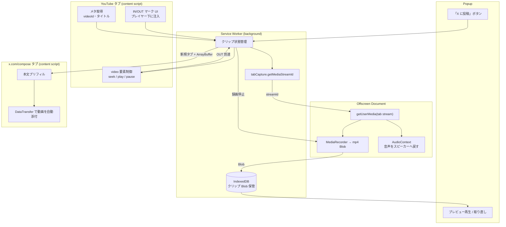
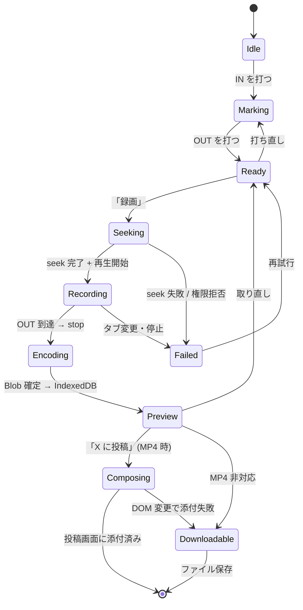
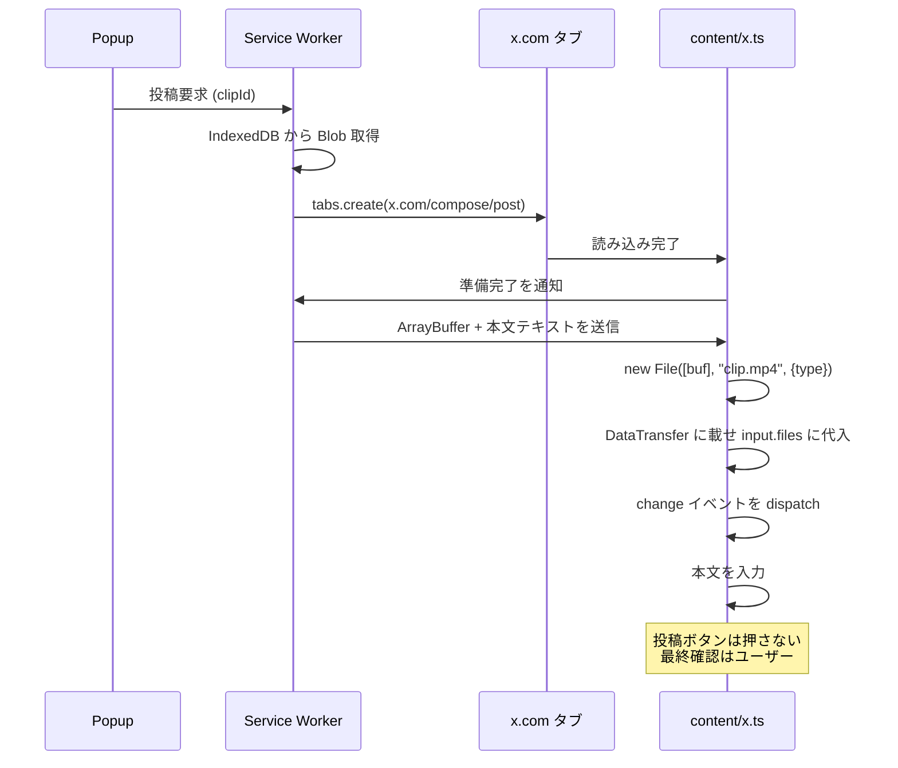

# yt-clip 設計ドキュメント

- 作成日: 2026-09-10 (JST)
- ステータス: 承認済み / 実装未着手
- スコープ: MVP (初回リリース)

## 1. 目的

YouTube を視聴中に「ここからここまで」を指定するだけで、その区間を動画ファイルとして切り抜き、X の投稿画面に本文つきで自動添付するところまでを一気通貫で行う Chrome 拡張機能を作る。

ユーザーは切り抜きたい場面を見つけてから投稿するまでに、動画のダウンロード・編集ソフトでのトリミング・ファイルの手動添付・元動画 URL のコピーといった作業を強いられている。これらをブラウザ内で完結させ、外部ツールのインストールを一切不要にすることをゴールとする。

## 2. 成功基準

- YouTube 視聴ページで IN/OUT を指定してから X の投稿画面に動画が添付された状態になるまで、ユーザーの操作が「IN・OUT・録画・投稿」の 4 クリックで完了する
- 生成される動画が X にそのままアップロード可能な形式 (MP4 / H.264 / AAC) である
- 外部バイナリ (yt-dlp, ffmpeg 等) のインストールを必要としない
- 意図した区間が過不足なく録画される (冒頭の欠落・末尾の余りがない)

## 3. 方式選定と根拠

設計にあたり以下を決定した。

| 論点 | 決定 | 却下した案と理由 |
|---|---|---|
| 実行形態 | Chrome 拡張 (MV3) | CLI: 視聴フローから切れる |
| 切り抜きの実体 | `chrome.tabCapture` によるタブ録画 | ローカルヘルパー連携 (yt-dlp/ffmpeg): 別途インストールが必要で配布が重い。リンク投稿のみ: X 上でインライン再生されず拡散力が落ちる |
| X への投稿 | 投稿画面を開いて本文プリフィル + 動画を自動添付。投稿ボタンは押さない | X API 完全自動投稿: 開発者登録が必要で、API プランにより投稿上限や動画アップロード可否の制約を負う。誤投稿のリスクもある |
| 範囲指定 | IN/OUT マーク → 自動 seek → 自動録画 | 録画開始/停止ボタン: 開始を押した時点で既に名場面が始まっている。巻き戻し録画: 常時録画の CPU/メモリコストと実装複雑度が MVP に見合わない |

ブラウザ内だけで YouTube の動画実体を取得することは技術的にも規約的にも不可能なため、「画面に再生されているものを録る」タブキャプチャ方式を採る。この選択は後述する構造的制約 (実時間録画・画質が再生解像度依存) を伴うが、外部依存ゼロという最大の利点と引き換えに受け入れる。

## 4. アーキテクチャ

Manifest V3 拡張。MV3 の service worker は DOM も `MediaRecorder` も持てないため、録画処理は offscreen document に隔離する。



### コンポーネント責務

| コンポーネント | 責務 | 依存 |
|---|---|---|
| `content/youtube.ts` | IN/OUT UI の注入、`video` 要素の seek/再生制御、メタ取得 | YouTube DOM |
| `background/sw.ts` | 状態機械、streamId 取得、offscreen ライフサイクル、IndexedDB | chrome API のみ |
| `offscreen/recorder.ts` | tab stream の取得と MediaRecorder 駆動、音声パススルー | streamId のみ |
| `popup/` | IN/OUT 確認、録画トリガ、プレビュー、投稿トリガ | background への message |
| `content/x.ts` | 本文プリフィルと動画添付 | x.com DOM |

境界設計の要点は、offscreen document を「streamId を受け取って Blob を返すだけ」の部品に保つこと。YouTube も X も知らないため、単体で差し替え・テストが可能になる。

## 5. 録画パイプラインと状態遷移



`Downloadable` は録画済み Blob を保持したままファイル保存に退避する終端状態であり、MP4 非対応時と X への自動添付失敗時の共通の受け皿になる。

`Seeking` を独立した状態として持つのは、seek 完了を待たずに録画を開始すると冒頭が欠けるため。`video.currentTime = IN` の後に `seeked` イベント、続いて `playing` イベントを待ってから `MediaRecorder.start()` を呼ぶ。

停止側は `timeupdate` (発火間隔が粗く精度が出ない) ではなく `requestVideoFrameCallback` で OUT フレームの到達を検出して停止する。

### 構造的制約と扱い

| 制約 | 内容 | 設計上の扱い |
|---|---|---|
| 実時間録画 | 30 秒のクリップに 30 秒かかる。倍速再生すると早送り映像がそのまま記録されるため等速固定 | 進捗バーで残り秒数を表示。最大クリップ長を 60 秒に制限 |
| 音声のミュート | tabCapture 中はタブ音声がスピーカーから出なくなる | offscreen 側で `AudioContext` を通し `destination` へ流し戻す |
| 広告の混入 | 録画中に広告が挟まると内容に混入する | 録画開始前に広告再生中を検出したら中断し再試行を促す |
| 画質が再生解像度依存 | 画面に表示されている解像度が上限 | 録画開始前に低解像度を検出したら警告を表示 |

### 出力コーデックと degraded path

X が受け付ける動画は MP4 (H.264/AAC) または MOV であり、WebM は拒否される。一方 `MediaRecorder` の既定出力は WebM (VP8/VP9 + Opus) である。近年の Chrome は MP4/H.264 での録画に対応しているが環境差があるため、起動時に判定して経路を分ける。

1. 起動時に `MediaRecorder.isTypeSupported('video/mp4;codecs="avc1.42E01E,mp4a.40.2"')` を評価する
2. **対応時 (通常フロー)**: MP4 で直接録画し、プレビューを経て X へ自動添付する
3. **非対応時 (degraded path)**: WebM で録画する。プレビューまでは同一で、投稿ボタンの代わりに「WebM をダウンロード」を表示し、「この環境では X に直接添付できません。変換してご利用ください」と明示する

判定は起動時に一度行い、popup の表示自体を切り替える。ffmpeg.wasm による WebM→MP4 変換は、数 MB のバイナリ追加と変換待ちが MVP に見合わないため将来の拡張とする。

## 6. X 投稿フロー

拡張が生成した `blob:` URL は拡張オリジンのものであり x.com の content script からは読めない。かといって数 MB〜数十 MB を `sendMessage` で運ぶのは重いため、クリップ長を 60 秒に制限した上で ArrayBuffer として転送する。



添付の実装:

```js
const dt = new DataTransfer();
dt.items.add(file);
input.files = dt.files;
input.dispatchEvent(new Event("change", { bubbles: true }));
```

本文プリフィルは React 管理下の contenteditable が対象のため、`textContent` への代入では state に反映されない。`document.execCommand("insertText")` またはネイティブ setter 経由で値を設定した上で `input` イベントを発火させる。

**投稿ボタンは押さない。** 最終確認はユーザーに残す。誤投稿が取り返しのつかない操作であることと、自動投稿が X の自動化ポリシーに抵触しうることによる。

### 本文テンプレート

既定値 (設定で編集可能):

```
{title}

{url}
```

利用可能な変数:

| 変数 | 展開結果 |
|---|---|
| `{title}` | 動画タイトル |
| `{url}` | `https://youtu.be/{videoId}?t={IN秒}` |
| `{videoId}` | YouTube の動画 ID |
| `{start}` | IN 位置 (mm:ss) |
| `{end}` | OUT 位置 (mm:ss) |
| `{duration}` | クリップ長 (秒) |

## 7. ディレクトリ構成と技術スタック

TypeScript + Vite + `@crxjs/vite-plugin`。UI は popup と注入 UI のみで小規模なため、フレームワークを使わず素の DOM で実装する。

```
src/
  background/
    sw.ts             # エントリ。message ルーティングのみ
    state.ts          # 状態機械（純粋関数）
    storage.ts        # IndexedDB へのクリップ CRUD
    capture.ts        # tabCapture + offscreen ライフサイクル
  offscreen/
    offscreen.html
    recorder.ts       # streamId → Blob。他を一切知らない
    codec.ts          # MP4 対応判定
  content/
    youtube.ts        # UI 注入と player 制御
    player.ts         # seek/play/待機の Promise ラッパ
    x.ts              # プリフィルと添付
  popup/
    popup.html / popup.ts
  shared/
    messages.ts       # message 型定義（両端で共有）
    template.ts       # 本文テンプレート展開
    time.ts           # 秒 ⇄ 表示、範囲バリデーション
```

`shared/` 配下の 3 モジュールは chrome API に触れない純粋関数であり、そのまま単体テストできる。

### 必要な権限

| 権限 | 用途 |
|---|---|
| `tabCapture` | タブの映像・音声取得 |
| `offscreen` | offscreen document の生成 |
| `storage` | 設定 (本文テンプレート) の保存 |
| `tabs` | X 投稿画面タブの生成 |
| `downloads` | degraded path でのファイル保存 |
| host: `https://www.youtube.com/*` | UI 注入・player 制御 |
| host: `https://x.com/*` | 本文プリフィル・自動添付 |

## 8. テスト方針

| 層 | 対象 | 手段 |
|---|---|---|
| 単体 | `template` / `time` / `state` (状態遷移表) | Vitest。chrome API モック不要 |
| 結合 | `storage` (IndexedDB)、message 往復 | Vitest + fake-indexeddb、chrome スタブ |
| E2E | YouTube 上で UI が注入され、短いクリップの録画が Blob 生成まで通ること | Playwright の永続コンテキストで拡張をロード。MVP ではスモーク 1 本のみ |

E2E の自動化範囲は **YouTube 側の録画完了まで**とする。X への添付検証はログイン済みアカウントを要し、自動化すると認証情報の管理が必要になる上に X の自動化ポリシー上も望ましくないため、**リリース前の手動確認項目**として扱う。

E2E を 1 本に絞るのは、実時間録画と実 DOM が絡むためテストが遅く壊れやすいことによる。壊れやすい DOM 依存部分はテストではなく実行時の防御で守る。具体的には、**セレクタ定義を 1 ファイルに集約し、要素が見つからなければ即座に degraded path へ落とす**。

## 9. エラーハンドリング

**fail fast を貫く。** 想定できる失敗はすべて明示的な失敗状態としてユーザーに理由を提示し、握り潰した継続はしない。

| 失敗 | ユーザーへの提示 | 復帰先 |
|---|---|---|
| tabCapture 権限拒否 | 権限が必要な旨を表示 | `Ready` |
| seek 失敗 | 再試行を促す | `Ready` |
| 広告再生中 | 広告終了後の再試行を促す | `Ready` |
| MP4 非対応 | 録画前に degraded path を予告 | 継続 (WebM) |
| x.com の DOM 変更で添付失敗 | 「X の画面構成が変わったため自動添付できませんでした。ファイルをダウンロードして手動で添付してください」 | ダウンロードへ退避 |
| タブ消失・録画中断 | 中断した旨を表示 | `Ready` |

例外として、**録画自体は成功したがその先の工程で失敗した場合は成果物を捨てない**。degraded path と同じダウンロードの受け皿に合流させる。

## 10. MVP に含めないもの (将来の拡張)

- 縦型 (9:16) / 正方形 (1:1) へのクロップ
- テロップ・字幕の焼き込み
- X API 連携による完全自動投稿
- ffmpeg.wasm による WebM→MP4 変換
- 巻き戻し録画 (常時バックグラウンド録画)
- 複数クリップの管理画面
- 録画前の再生画質の自動最大化
