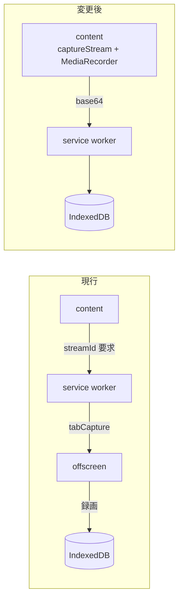

# 録画方式の変更と範囲指定 UI の設計

- 作成日: 2026-09-11 (JST)
- ステータス: 承認済み / 実装未着手
- 前提: `.claude/specs/2026-09-10-yt-clip-design.md` (MVP の設計) を置き換える部分がある

## 1. 背景

MVP を実機で検証したところ、3 点の問題が判明した。いずれも単体テストでは検出できず、実際に使って初めて分かったものである。

1. **タブ全体が録画されていた。** コメント欄・関連動画・プレイヤーのコントロールまで映像に入る。`chrome.tabCapture` はタブに表示されているものを録る API であり、これは仕様どおりの動作である。「切り抜き = 動画の中身だけ」という当然の期待を、MVP の設計が捉えていなかった
2. **X への自動添付が失敗する。** service worker のログから `document.execCommand("insertText")` が `false` を返していることを特定した。セレクタは実際の DOM と一致しており、原因は本文入力の側にある
3. **IN/OUT の微調整ができない。** ボタンを押した瞬間の再生位置がそのまま範囲になるため、押すタイミングの精度がそのまま結果の精度になる

## 2. 目的

- 動画の中身だけを、動画本来の解像度で録画する
- X への本文入力を確実に成功させる。失敗したときは原因が分かる形で残す
- 範囲を後から視覚的に微調整できるようにし、録画前に内容を確認できるようにする

## 3. 録画方式の変更

### 3.1 決定

`chrome.tabCapture` をやめ、**content script から `video` 要素の `captureStream()` を直接録画する**。

### 3.2 根拠

| 観点 | tabCapture (現行) | captureStream (変更後) |
|---|---|---|
| 映像の範囲 | タブ全体。UI が混入する | 動画の中身のみ |
| 解像度 | 画面に表示されている解像度が上限 | 動画本来の解像度 |
| 必要な権限 | `tabCapture` / `offscreen` | なし |
| 呼び出しの制約 | 拡張がそのタブに対して呼び出されている必要がある (ツールバー経由で popup を開く) | なし |
| DRM 保護動画 | 録画できる | 黒画面になる |

DRM 保護動画で録れなくなるのが唯一の後退だが、通常の YouTube 動画は対象外であり、後述の検出で明示的に失敗させる。それ以外はすべての観点で優れている。

> **追補 (2026-09-12, whole-branch review D-4 / I-7)**
> 上の表の「解像度: 動画本来の解像度」は**実装と食い違っている**。`video.captureStream()` が
> 返すのはデコード済みのフレームであり、解像度は `videoWidth/videoHeight` = **いま再生中の画質**になる。
> 360p で再生しながら録れば 360p のクリップができる。tabCapture の「画面に表示されている解像度が上限」
> (= 表示サイズ依存) よりは優れているが、「動画本来の解像度」ではない。
> 実装は再生画質が 720p 未満のときに警告を出す (録画は止めない)。
> `README.md` の「仕様と制約」と `docs/manual-check.md` の「録画エンジン」が正となる。

### 3.3 構成の変化



**削除するもの:**

- `src/offscreen/` 配下 4 ファイル (`codec.ts` / `recorder.ts` / `main.ts` / `offscreen.html`)
- `src/background/capture.ts`
- `tests/offscreen/codec.test.ts`、`tests/background/capture.test.ts`
- manifest の `tabCapture` / `offscreen` 権限
- `vite.config.ts` の offscreen エントリ
- 失敗理由 `capture-permission-denied`

**移動するもの:**

- MP4 / WebM の判定 (`pickMimeType`) は content script 側へ移す。`MediaRecorder` を持つ場所が移動するため
- 録画本体 (`startRecording`) も content script 側へ。**音声パススルーは不要になる。** `captureStream()` は `video` 要素の音声トラックも含めて返し、かつタブの音声出力を奪わないため、スピーカーへ流し戻す処理が要らなくなる

**増えるもの:**

- content script から service worker への base64 転送が 1 往復。60 秒制限があるため許容する

### 3.4 DRM 保護動画の検出

録画を開始する前に `video.mediaKeys` を確認する。`null` でなければ暗号化メディアが使われており、`captureStream()` は黒画面になる。この時点で失敗させる。

- 新しい失敗理由: `drm-protected`
- 文言: 「この動画は保護されているため録画できません」

録画してから気付くと、ユーザーは実時間のコストを払った後で無駄と知ることになる。**開始前に判定することが要件である。**

## 4. X への本文入力

### 4.1 調査結果

実際の投稿画面を確認したところ、セレクタは一致していた。

| 要素 | 実際の DOM |
|---|---|
| ファイル入力 | `input[type=file]` / `data-testid="fileInput"` / `accept` に `video/mp4` を含む |
| 本文 | `div[data-testid="tweetTextarea_0"]` / `role="textbox"` / `contenteditable="true"` / `public-DraftEditor-content` (Draft.js) |

ページのコンテキストで入力方式を試した結果:

| 方式 | 結果 |
|---|---|
| `focus()` + `execCommand("insertText")` | 成功 |
| `focus()` + Selection 設定 + `execCommand` | 成功 |
| `paste` イベント | 成功 |
| `beforeinput` (`insertFromPaste`) | 失敗 |

**現行方式はページのコンテキストでは動作する。** つまり実装のロジック自体は正しく、content script の実行環境 (isolated world) かタイミングに原因がある。有力なのは、先にファイルを添付して X が UI を再描画している最中に本文入力が走り、フォーカスが確立できていないケースである。

### 4.2 決定

原因を断定できていないため、片方に賭けず 3 段構えにする。

1. **順序を入れ替える。** 本文入力を先、ファイル添付を後にする。X が添付処理で DOM を再描画する前に本文を入れる
2. `focus()` の後に `Range` / `Selection` を明示設定してから `execCommand`
3. それでも `false` なら `paste` イベントにフォールバックする

**どの方式で成功したかを `console.info` に残す。** 次に壊れたとき、どこまで効いていたのかが分かる。

## 5. 範囲指定 UI

### 5.1 決定

YouTube のシークバーには範囲を帯で重ねて位置を示すだけにし、**プレイヤーの下に拡大バーを出して**そこで IN/OUT ハンドルをドラッグする。

```
YouTube プレイヤー
├────────────────────────────────────────────────┤ ← 既存のシークバー
                    ▓▓▓                            （範囲を帯で重ねる）

[IN] [OUT]  12:34 〜 12:49 (15秒)        [範囲を再生]
┌──────────────────────────────────────────────┐
│  12:19        ▐━━━━━━━━━━━━━━━━▌        13:04  │ ← 拡大バー
│              IN                OUT              │
└──────────────────────────────────────────────┘
```

### 5.2 根拠

YouTube のシークバーは動画全長を表す。1 時間の動画で 30 秒の範囲はバー全体の 0.8% しかなく、ドラッグでの微調整ができない。iOS の動画編集が成立するのは素材が数分だからであり、そのまま持ち込むと使えない。

拡大バーを併設すれば、動画の長さに関わらず秒単位で調整できる。

### 5.3 操作フロー

1. 視聴中に **IN** を押す。押した位置から既定 15 秒の範囲が自動で作られ、拡大バーが出る。15 秒という値は「多くの切り抜きがこの程度に収まり、足りなければ広げる方が縮めるより操作が少ない」という想定による固定値で、MVP では設定できるようにしない
2. 拡大バーで **ハンドルをドラッグして微調整**。ドラッグ中は動画がその位置に追従する (スクラブ)
3. **範囲を再生** で内容を確認する
4. popup の **録画** を押す

**OUT ボタンも残す。** 「ここまで」を再生しながらその場で決めたい場合に使う。どちらを押した後も拡大バーで微調整できる。

### 5.4 拡大バーの窓

範囲が確定した時点で決まる。

- 幅: `max(範囲の長さ × 2, 30 秒)`
- 中心: 範囲の中心
- 動画の端を超える場合はクランプする

**窓はスクロールしない。** ハンドルが窓の端に達したらそこで止まる。大きく動かしたいときは IN を押し直す方が速く、窓のスクロールは実装も操作も複雑になるため MVP では入れない。

### 5.5 制約

- 最大 60 秒 / 最小 1 秒 (既存の `validateRange` をそのまま使う)
- ドラッグ中に制約を超える位置へは動かせない (ハンドルが止まる)
- したがって不正な範囲が service worker へ送られることはない

### 5.6 状態機械の簡素化

**`marking` 状態を削除する。** IN を押した時点で範囲ができるため、「IN だけ押した中間状態」が存在しなくなる。`idle → ready` に直行する。

- `MARK_IN`: どの状態からでも `ready` へ (既定 15 秒の範囲つき)
- `MARK_OUT`: `ready` → `ready` (終了位置を更新)
- `ADJUST_RANGE` (新規): `ready` → `ready`。ペイロードは `{ range: ClipRange }` で、開始と終了の両方を毎回送る。片方だけ送る設計にすると、送信の取りこぼしで content script 側と service worker 側の範囲がずれる

ドラッグ結果は**指を離したときに 1 度だけ**送る。ドラッグ中は content script 内でローカルに保持する。

**録画中は範囲を変更できない。** `seeking` / `recording` / `encoding` の間は `MARK_IN` / `MARK_OUT` / `ADJUST_RANGE` のいずれも受け付けない (既存の仕組みをそのまま使う)。状態機械だけが範囲を戻し、録画が走り続ける事態を防ぐため。UI 側でもボタンとハンドルを操作不能にする。

## 6. ファイル構成

| ファイル | 変更 | 責務 |
|---|---|---|
| `src/content/range-math.ts` | **新規** | ピクセル⇄秒の変換、窓の算出、制約クランプ。純粋関数 |
| `src/content/range-bar.ts` | **新規** | 拡大バーの描画とドラッグ処理 |
| `src/content/recorder.ts` | **新規** | `captureStream()` + `MediaRecorder`。offscreen から移設 |
| `src/content/codec.ts` | **新規** | MP4 / WebM の判定。offscreen から移設 |
| `src/content/youtube.ts` | 改修 | 注入と状態連携 |
| `src/content/x.ts` | 改修 | 入力順序の変更と 3 段構えの入力 |
| `src/shared/types.ts` | 改修 | `marking` 削除、`ADJUST_RANGE` 追加、失敗理由の入れ替え |
| `src/background/state.ts` | 改修 | `marking` 削除に伴う遷移の整理 |
| `src/background/router.ts` | 改修 | 録画指示の送り先を offscreen から content へ |
| `src/popup/view.ts` | 改修 | `marking` 削除、`drm-protected` の文言追加 |

## 7. テスト方針

| 対象 | 方法 | 理由 |
|---|---|---|
| `range-math.ts` | **単体テスト (厚く)** | 座標計算は間違えやすく、実機でしか気付けない類。ここを固めれば UI の不具合は「描画と配線」に絞り込める |
| 状態機械の変更 | 単体テスト | 既存の `state.test.ts` を更新 |
| `captureStream` / `MediaRecorder` | 手動確認 | jsdom に存在しない |
| ドラッグ操作 | 手動確認 | jsdom では `getBoundingClientRect` が 0 になり検証にならない |
| 本文入力の 3 段構え | 手動確認 | `execCommand` が jsdom に存在しない。どの方式で成功したかログに出す |

## 8. 手動確認に追加する項目

- 録画された動画に**コメント欄やコントロールバーが映っていない**
- 録画された動画の解像度が、再生解像度ではなく**動画本来の解像度**になっている
- DRM 保護された動画 (有料レンタル等) で、**録画開始前に**「保護されているため録画できません」と出る
- ツールバーからではなく**YouTube のページから直接**録画を開始できる (権限エラーが出ない)
- X の本文が正しく入る。service worker のログにどの方式で成功したかが出ている
- 1 時間以上の動画で、拡大バーのハンドルが**秒単位で動かせる**
- ハンドルをドラッグすると動画がその位置に追従する
- 「範囲を再生」で IN から OUT まで再生され、OUT で止まる
- ハンドルが窓の端で止まり、それ以上動かない

## 9. この設計に含めないもの

- 拡大バーの窓のスクロール (ハンドルが端に達したときの自動追従)
- DRM 保護動画のための tabCapture フォールバック
- 波形表示・サムネイル表示
- 複数範囲の同時指定
